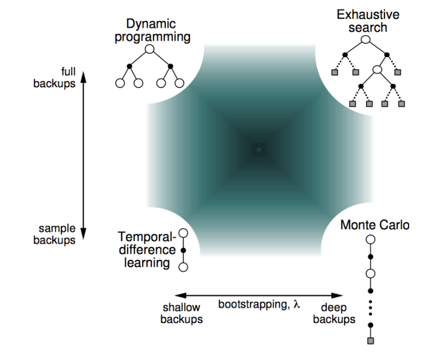
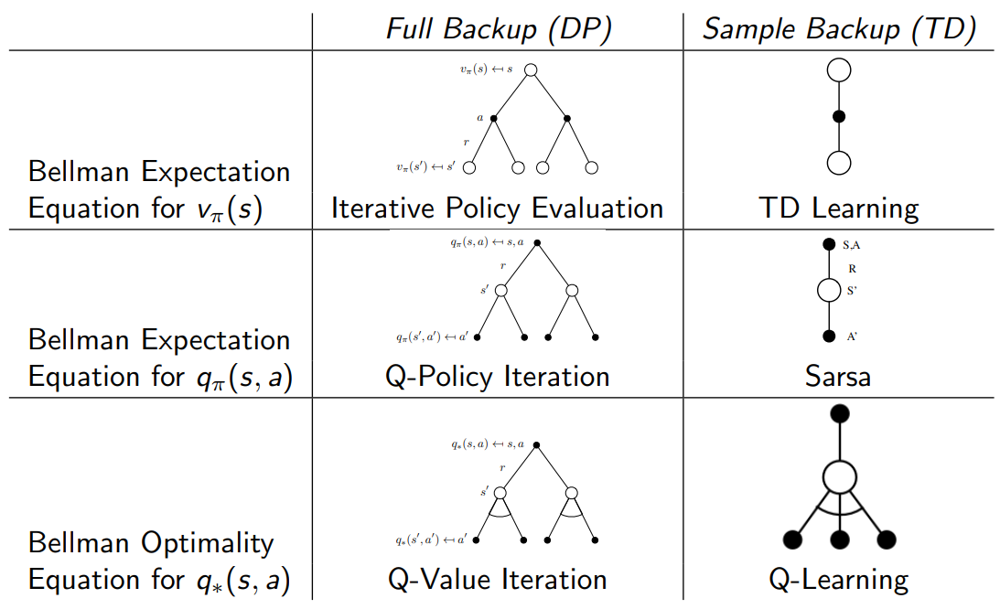
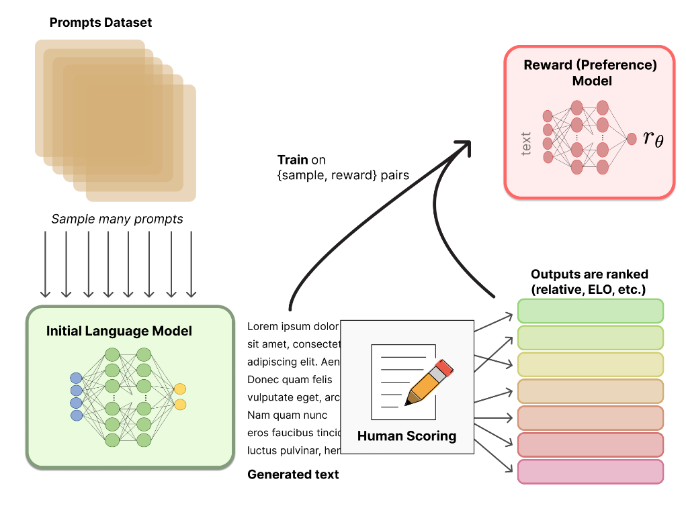
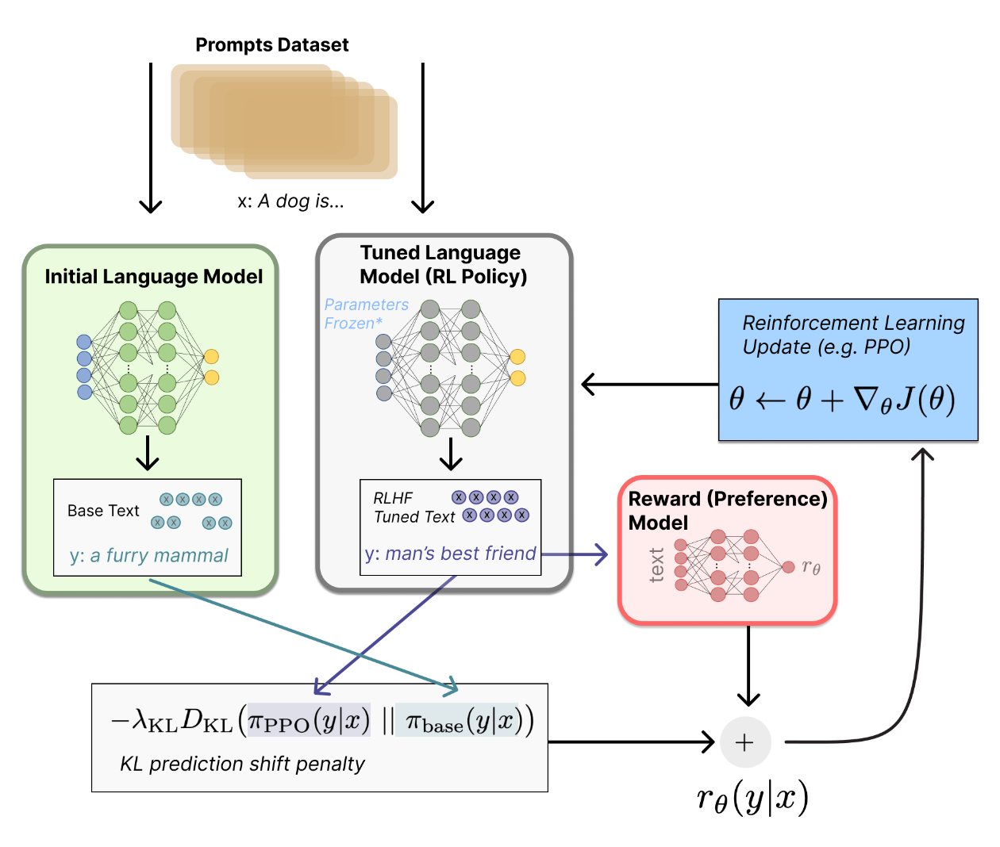

# 一、强化学习的基本范式与概念

## 1.1 强化学习组成部分

- 强化学习的目标：最大化未来累计奖励
  - 某次行动可能会产生长期后果
  - 奖励可能会延迟
  - 牺牲眼前的回报来获得更多可能会更好的长期奖励
- 在强化学习中，时间步 $t$ 发生的事情
  - Agent
    - 执行动作 $A_t$
    - 接收到观察 $O_t$
    - 接收到奖励 $R_t$
  - 环境
    - 接收到动作 $A_t$
    - 给出观察 $O_t$
    - 给出奖励 $R_t$
    - 下一个时间步
  - 历史序列 $H_t=O_1,R_1,A_1,\cdots,A_{t-1},O_t,R_t$
  - 状态 $S_t=f(H_t)$
    - 环境的状态 $S_t^e$
    - Agent 的状态 $S_t^a$​
- 强化学习 Agent 具有的组件
  - 策略
    - Agent 的行为函数，从状态到行动的映射
    - 确定性：$a=\pi(s)$
    - 概率分布：$\pi(a|s)=P[A_t=a|S_t=s]$
  - 价值函数
    - 对未来价值的预测，衡量状态 / 行动的好坏
    - $v_{\pi}(s)=E_{\pi}[R_{t+1}+\gamma R_{t+2}+\gamma^2R_{t+3}+\dots|S_t=s]$
  - 模型
    - Agent 对环境的表示，预测环境下一步会做什么
    - $\mathcal{P}$ 预测下一个状态：$\mathcal{P}_{ss^{\prime}}^a =\mathbb{P}[S_{t+1}=s^{\prime}\mid S_t=s,A_t=a]$
    - $\mathcal{R}$ 预测下一个即时奖励：$\mathcal{R}_s^a =\mathbb{E}\left[R_{t+1}\mid S_t=s,A_t=a\right]$

## 1.2 强化学习分类

### 1.2.1 基于价值与基于策略

- 基于价值函数：隐式策略，有价值函数
  - Q-Learning、Sarsa
  - **投资顾问**：假如你想理财，不知道具体怎么投资，投资顾问帮你分析每种投资方式的「回报潜力」（即价值）。然后，你选择回报潜力最高的投资方式。顾问的目标是不断提高其估算价值的准确性
- 基于策略：有策略，无价值函数
  - 策略梯度（Policy Gradients）方法，如 PPO、Actor-Critic
  - **厨师学徒**：假如你想成为厨师，最好的办法是直接模仿和优化你的烹饪方法，而不是先学理论（价值函数）再去试验。通过尝试，你会直接调整策略，例如切菜快一点、火候控制得更精准，从而做出更好的菜
- Actor-Critic：有策略，有价值函数
  - 团队合作的过程：**Actor 是厨师学徒**，试着做菜（决策）；**Critic 是美食评论家**，评价菜的好坏并给出建议（价值评估）

### 1.2.2 Model-Free 与 Model-Based

- Model-Free：策略 / 价值函数，无模型
  - 不对环境进行建模，直接与真实环境进行交互来学习到最优策略
  - 泛化性优于 Model-Based
  - **盲目尝试的冒险家**： 假设你第一次去一个迷宫探险，不熟悉地形，也没有地图，你只能靠反复尝试不同的路径，逐步摸索出哪条路是最好的。你不关心迷宫的结构，只关注行动的效果，例如「向左」可以减少时间，「向右」会遇到障碍
- Model-Based：策略 / 价值函数，有模型
  - 根据环境中的经验，构建一个虚拟世界，同时真实环境和虚拟世界中学习
  - 构建环境模型：学会一个函数，能够预测当前状态下的**环境动态**，即 **状态转移** 和 **奖励函数**
  - **理性计划的探险家**： 假设你去迷宫探险，但这次你拿到了一张迷宫的地图（即环境模型）。在出发前，你可以先研究地图，推测出最短路径或者避开障碍的路线，然后按计划行动。即使还没进入迷宫，你就能做出不错的决策

### 1.2.3 在线学习与离线学习（Online 与 Offline）

- 在线学习
  - 在**在线学习**中，**策略网络**会实时与环境进行交互，采集新的数据（状态、动作、奖励等），然后利用这些新数据进行策略更新
  - 每次更新策略后，下一轮的数据采集会基于当前的更新后的策略进行，这种交互是**动态的**
- 离线学习
  - 在**离线学习**中，数据已经**预先采集**好，存储在固定的数据集中
  - 策略更新时**不再与环境交互**，而是基于静态数据集进行训练
  - 这种方式类似于**监督学习**，目标是最小化策略和标签之间的差异

### 1.2.4 在策略与离策略（On-Policy 与 Off-Policy）

- **On/Off Policy 与 Online/Offline** 决定了训练数据的来源与使用方式

| 类别     | On-policy Learning                              | Off-policy Learning                                             |
| -------- | ----------------------------------------------- | --------------------------------------------------------------- |
| 学习目标 | 直接学习当前执行的策略 $\pi$ 的价值或改进 $\pi$ | 学习目标策略 $\pi$ 的价值，但经验来自另一个行为策略 $\mu$       |
| 行为策略 | 行为策略和目标策略一致 $\mu = \pi$              | 行为策略和目标策略可能不同 $\mu \neq \pi$，也可能是 $\pi_{old}$ |
| 数据来源 | 从当前策略 $\pi$ 采样的交互经验（行动和状态）   | 从其他策略 $\mu$ 或环境采样的经验数据                           |
| 形象描述 | 在岗位上工作时学习技能                          | 通过观察别人工作而学习技能                                      |
| 优点     | 学习和执行策略一致，简单直观                    | 可以探索最优策略 $\pi^*$，学习灵活                              |
| 缺点     | 受限于当前策略 $\pi$，可能收敛到次优策略        | 需要重要性采样或其他机制解决策略差异引发的偏差                  |
| 例子     | SARSA                                           | Q-learning                                                      |

## 1.3 强化学习常见概念

### 1.3.1 偏差与方差（Bias 与 Variance）

- 简单直觉区别：偏差告诉你模型有没有 “学对”，方差告诉你模型有没有 “学稳”；我们希望模型低偏差、低方差，但往往需要在两者之间做权衡

- 数学公式理解（期望均方误差（MSE）分解）：

$$
\mathbb{E}[(\hat{f}(x) - f(x))^2] = \underbrace{[\mathbb{E}[\hat{f}(x)] - f(x)]^2}_{\text{Bias}^2} + \underbrace{\mathbb{E}[(\hat{f}(x) - \mathbb{E}[\hat{f}(x)])^2]}_{\text{Variance}} + \underbrace{\sigma^2}_{\text{不可约误差}}
$$

- 其中：

  - $f(x)$：真实函数

  - $\hat{f}(x)$：模型预测值

  - $\mathbb{E}[\hat{f}(x)]$​：在不同训练集上的平均预测

| 项目       | 偏差（Bias）                                       | 方差（Variance）                                           | 不可约误差                                             |
| ---------- | -------------------------------------------------- | ---------------------------------------------------------- | ------------------------------------------------------ |
| 定义       | 平均预测值 vs 真值之间的差，表示模型结构本身的能力 | 模型在不同训练数据上的输出波动，反映其对训练数据的敏感程度 | 来自数据本身的噪声或环境的随机性，无法通过任何模型消除 |
| 靶心图例子 | 飞镖总是集中在靶心左下角，系统性偏离               | 飞镖落得很散，有时东有时西，不稳定                         | 飞镖围绕靶心附近随机分布，即使瞄得准也有误差           |
| 通俗解释   | 算法是否 “学得准”                                  | 算法是否 “学得稳”                                          | 世界本身是否 “稳定可预测”                              |
| 理想状态   | 偏差低（拟合好）                                   | 方差低（不敏感）                                           | 越低越好，但不可避免，无法消除                         |

### 1.3.2 学习与规划（Learning 与 Planning）

- 学习 ——MC、TD
  - 环境初始是未知的
  - Agent 与环境交互后改进策略
- 规划 —— 动态规划
  - 环境模型是已知的
  - Agent 基于模型执行行动（没有任何外部交互）后改进策略
  - 又名深思熟虑、推理、内省、沉思、思考、寻找

### 1.3.3 探索与利用（Exploration 与 Exploitation）

- 探索
  - 尝试新的动作，找到关于环境的更多信息
  - 可能带来更高长期回报的策略、动作或状态，帮助智能体避免陷入局部最优解
  - **过度探索**：智能体会浪费大量时间尝试不太可能带来高回报的动作，无法充分利用已知的信息
- 利用
  - 基于已有知识选择最优动作，以最大化当前的即时回报
  - **过度利用**：智能体可能停留在次优的策略上（局部最优解），无法发现更高回报的选择
- Trade-Off
  - 采用上置信界（Upper Confidence Bound, UCB）
    - 同时考虑动作的预期回报和不确定性（置信区间）
    - 高不确定性和高回报的动作会被优先选择，特别适用于多臂赌博机（Multi-Armed Bandit）问题
  - 采用 $\epsilon-$​ 贪心
    - 以 $\epsilon$ 的概率进行探索（随机选择动作）
    - 以 $1-\epsilon$ 的概率进行利用（选择当前最优动作）
    - 一般设置初始 $\epsilon$​ 较大（偏向探索），然后逐渐减小（偏向利用）

### 1.3.4 预测与控制（Prediction 与 Control）

- 预测：评估未来
  - 给定一个策略（policy），评估该策略在未来的表现
    - 目标：计算每个状态的价值（Value），即该策略从当前状态开始执行后，期望获得的累计回报
    - 输入：已知的策略 $\pi(s, a)$，表示在每个状态下选择某动作的概率
    - 输出：状态值函数 $V^\pi(s)$ 或状态 - 动作值函数 $Q^\pi(s, a)$
      - $V^\pi(s)$：遵循策略 $\pi$ 时，从状态 $s$ 开始的期望总回报
      - $Q^\pi(s, a)$：遵循策略 $\pi$ 时，在状态 $s$ 执行动作 $a$​ 后的期望总回报
    - 这是一个评估任务，因为策略已经固定
  - 假设你有一个固定的策略（比如在迷宫中选择路径的方法），**Prediction** 的任务是告诉你如果执行这个策略，每个状态的长期收益会是多少
- 控制：优化未来
  - 寻找一个最优策略，使得未来的累计回报最大化
    - 目标：找到最佳策略 $\pi^*$，使得每个状态的价值 $V^{\pi^*}(s)$ 或 $Q^{\pi^*}(s, a)$ 达到最大
    - 核心问题：需要探索状态和动作的组合，确定哪个策略可以实现最优回报
  - 假设你不知道在迷宫中最优的行走策略，**Control** 的任务是通过试验和学习找到最短路径策略，从而最大化你的目标（如最快到达出口）

## 1.4 强化学习外延

### 1.4.1 逆向强化学习（Inverse Reinforcement Learning, IRL）

- 核心目标是从专家的行为中**推断潜在的奖励函数**
- 传统强化学习的逆过程
  - 传统强化学习的目标是根据已知的奖励函数找到最优策略
  - 逆向强化学习则是通过观察专家的最优策略或行为来推断背后的奖励函数

## 1.6 强化学习算法体系

```tsx
强化学习
├── [1] 已知MDP（Dynamic Programming）
│   ├── Prediction: 策略评估（Policy Evaluation）
│   └── Control
│       ├── 策略迭代（Policy Iteration）
│       └── 价值迭代（Value Iteration）
│
├── [2] 未知MDP（Sampling Backup）
│   ├── 基于模型（Model-Based RL）
│   │   ├── 环境模型学习
│   │   └── 结合DP方法进行规划
│   │       └── 例如：Dyna-Q
│   │
│   └── 不基于模型（Model-Free RL）
│       ├── Prediction
│       │   ├── MC方法（Monte Carlo）
│       │   └── TD方法（Temporal-Difference）
│       │       └── TD(0), TD(λ)
│       │
│       └── Control
│           ├── On-Policy
│           │   ├── Sarsa
│           │   └── Sarsa(λ)
│           │
│           └── Off-Policy
│               ├── Q-learning（最经典）
│               └── Expected Sarsa
│
├── [3] 深度强化学习（Deep RL）
│   ├── 基于值函数
│   │   └── DQN, Double DQN, Dueling DQN
│   ├── 基于策略梯度
│   │   └── REINFORCE, PPO, A2C, A3C
│   └── Actor-Critic 架构（值函数+策略）
│       └── DDPG, TD3, SAC
│
├── [4] Offline RL（脱离环境，离线数据上训练）
│   └── BC（行为克隆）、BCQ、CQL 等
│
└── [5] Online RL（与环境交互）
    └── 几乎所有经典算法（Q-Learning、DQN、PPO等）
```

# 二、经典强化学习

## 2.1 马尔可夫链

### 2.1.1 马尔可夫随机过程

- 马尔可夫状态
  - $P[S_{t+1}|S_t]=P[S_{t+1}|S_1,\cdots,S_t]$
  - 基于现在，未来独立于过去：$H_{1:t}\rightarrow S_t\rightarrow H_{t+1:\infty}$
  - 一旦有了当前状态，历史可以被抛弃
  - 当前状态是未来的充分统计数据
- 马尔可夫随机过程（Markov Processes）
  - 马尔可夫随机过程由二元组 $(\mathcal{S},\mathcal{P})$ 组成
    - $\mathcal{S}$：状态空间（所有可能状态的集合）
    - $\mathcal{P}$：状态转移概率矩阵，定义从当前状态 $s_t$ 转移到下一个额状态 $s_{t+1}$ 的概率 $P(s_{t+1}|s_t)$
      - $\mathcal{P}_{ss^{'}}=P[S_{t+1}=S^{'}|S_t=s]$

### 2.1.2 马尔可夫奖励过程

- 马尔可夫奖励过程（Markov Reward Processes）由四元组 $(\mathcal{S},\mathcal{P},\mathcal{R},\gamma)$​ 组成
  - $\mathcal{S}$：状态空间（所有可能状态的集合）
  - $\mathcal{P}$：状态转移概率矩阵，定义从当前状态 $s_t$ 转移到下一个额状态 $s_{t+1}$ 的概率 $P(s_{t+1}|s_t)$
  - $\mathcal{R}$：奖励函数，$\mathcal{R}_s=E[R_{t+1}|S_t=s]$
  - $\gamma$：折扣因子，$\gamma\in[0,1]$​，用于衡量未来奖励的当前价值
    - 当前获得的奖励 $R$ 在 $k+1$ 个时间步后的价值为 $\gamma^{k}R$
    - $\gamma\rightarrow0$ 时，趋近于” 近视 “评估（Mypoic）
    - $\gamma\rightarrow1$​ 时，趋近于” 远视 “评估（Far-Sighted）
  - 采用折扣因子的原因
    - 便于数学上的收敛计算
    - 折扣因子限制了回报的累积，确保问题可解并且奖励是有限的
    - 折扣因子通过对未来奖励进行加权，隐式表达了这种不确定性
    - 在金融或经济领域，折扣因子反映了**时间价值**的概念，即立即获得的奖励比未来的同样奖励更有价值
    - 人类和动物普遍更倾向于即时奖励而非延迟奖励，即 “即时满足倾向”
    - 在某些特殊情况下，可以使用不折扣的马尔可夫过程，例如：
      - **所有序列都终止**：如果问题设计保证智能体的每条路径最终都会结束，例如迷宫求解任务，回报的总和是有限的，无需引入折扣因子
      - **特定目标任务**：例如以目标状态为重点的问题，可能不关注时间步长
    - 未折扣的过程更适用于有界问题，而在无界问题中通常会引入折扣因子
- 值函数 $V(s)$
  - 从时间步 $t$ 开始的总折扣奖励值 / 回报（Return）：$G_t=R_{t+1}+\gamma R_{t+2}+\dots=\displaystyle\sum_{k=0}^{\infty}\gamma^{k}R_{t+k+1}$
  - 值函数则表示从当前状态 $s$ 开始的期望累计回报，评估状态的长期价值
    - $V(s)=E[G_t|S_t=s]$
  - 据此，值函数可以划分为两部分：即时奖励 $R_{t+1}$ 与折扣后的 $\gamma V(S_{t+1})$
    - $V(s)=E[G_t|S_t=s]=E[R_{t+1}+\gamma V(S_{t+1})|S_t=s]$​
- 贝尔曼方程（Bellman Equation）
  - 定义策略 $\pi$ 下价值函数和动作值函数的递归关系
  - $v=\mathcal{R}+\gamma\mathcal{P}v$，其中 $\begin{bmatrix}
    v(1) \\
    \vdots \\
    v(n)
    \end{bmatrix}=
    \begin{bmatrix}
    \mathcal{R}_{1} \\
    \vdots \\
    \mathcal{R}_{n}
    \end{bmatrix}+\gamma
    \begin{bmatrix}
    \mathcal{P}_{11} & \ldots & \mathcal{P}_{1n} \\
    \vdots \\
    \mathcal{P}_{11} & \ldots & \mathcal{P}_{nn}
    \end{bmatrix}
    \begin{bmatrix}
    v(1) \\
    \vdots \\
    v(n)
    \end{bmatrix}$​
  - $v=\mathcal{R}+\gamma\mathcal{P}v\Rightarrow (I-\gamma\mathcal{P})v=\mathcal{R}\Rightarrow v=(I-\gamma\mathcal{P})^{-1}\mathcal{R}$
- 贝尔曼方程的计算复杂度
  - 对于 $n$ 个状态，该方程的计算复杂度是 $O(n^3)$
  - 对于小的马尔科夫链，可以利用该公式计算
  - 对于较大的马尔科夫链，则需要使用一些迭代的方法，如动态规划、蒙特卡洛方法、时间差分学习

### 2.1.3 马尔可夫决策过程

- 马尔可夫决策过程（Markov Decision Process）是具有动作的马尔可夫奖励过程

- 马尔可夫奖励过程由五元组 $(\mathcal{S},\mathcal{A},\mathcal{P},\mathcal{R},\gamma)$​ 组成

  - $\mathcal{S}$​：状态空间（所有可能状态的集合）
  - $\mathcal{A}$：动作空间（所有可能动作的集合）
  - $\mathcal{P}$：状态转移概率矩阵，定义从当前状态 $s_t$** 执行动作 $a$** 转移到下一个额状态 $s_{t+1}$ 的概率
    - $\mathcal{P}_{ss^{'}}^{a}=P[S_{t+1}=S^{'}|S_t=s,A_t=a]$
  - $\mathcal{R}$：奖励函数，$\mathcal{R}_s^a=E[R_{t+1}|S_t=s,A_t=a]$
  - $\gamma$：折扣因子，$\gamma\in[0,1]$​，用于衡量未来奖励的当前价值

- 策略：给定状态时，动作的概率分布

  - $\pi(a|s)=P[A_t=a|S_t=s]$
  - 策略完整定义了 Agent 的行动，智能体在每个时间步会依据它选择动作
  - 在标准 MDP 中，策略是时间无关的，不会随着时间变化，只要状态相同，选择的行动均相同
  - $A_t\sim \pi(\cdot|S_t),\forall t>0$，即在任何时间步 $t > 0$，动作 $A_t$ 都是根据相同的策略 $\pi$ 从状态 $S_t$ 中抽样的

- 给定 $\mathcal{M}=(\mathcal{S},\mathcal{A},\mathcal{P},\mathcal{R},\gamma)$ 和策略 $\pi$

  - 马尔可夫过程：$(\mathcal{S},\mathcal{P}^{\pi})$
  - 马尔科夫奖励过程：$(\mathcal{S},\mathcal{P}^{\pi},\mathcal{R}^{\pi},\gamma)$
  - 其中，$\mathcal{P}_{s,s^{'}}^{\pi}=\displaystyle\sum_{a\in\mathcal{A}}\pi(a|s)\mathcal{P}_{ss^{'}}^{a}$ 且 $\mathcal{R}_{s}^{\pi}=\displaystyle\sum_{a\in\mathcal{A}}\pi(a|s)\mathcal{R}_{s}^{a}$​

- 值函数 $V_\pi(s)$

  - $V_{\pi}(s)=E_{\pi}[G_t|S_t=s]=E_{\pi}[R_{t+1}+\gamma V_{\pi}(S_{t+1})|S_t=s]$

  - 贝尔曼期望方程：当前状态 $s$ 的价值是，在策略 $\pi$ 下对所有动作和后续状态的加权期望

    $$
    \begin{aligned}
      V_{\pi}(s)&=\displaystyle\sum_{a\in\mathcal{A}}\pi(a|s)q_{\pi}(s,a)\\
    &=\displaystyle\sum_{a\in\mathcal{A}}\pi(a|s)\displaystyle\sum_{s^{\prime}\in\mathcal{S}}\mathcal{P}_{ss^{\prime}}^a\left(\mathcal{R}_{ss^{\prime}}^a+\gamma V_\pi(s^{\prime})\right)\\
      &=\displaystyle\sum_{a\in\mathcal{A}}\pi(a|s)\left(\mathcal{R}_s^a+\gamma\displaystyle\sum_{s^{\prime}\in\mathcal{S}}\mathcal{P}_{ss^{\prime}}^aV_\pi(s^{\prime})\right)\\
      \end{aligned}
    $$

  - 贝尔曼期望方程的矩阵形式：$v_\pi=\mathcal{R}^\pi+\gamma\mathcal{P}^\pi v_\pi$，则 $v_\pi=(I-\gamma\mathcal{P}^\pi)^{-1}\mathcal{R}^\pi$

- 动作值函数 $q_{\pi}(s,a)$
  - $q_{\pi}(s,a)=E_{\pi}[G_t|S_t=s,A_t=a]=E_{\pi}[R_{t+1}+\gamma q_{\pi}(S_{t+1},A_{t+1})|S_t=s,A_t=a]$
  - 表示从当前状态 $s$ 开始选择动作 $a$ 的期望累计回报，即评估 Agent 在状态 $s$ 下选择特定动作 $a$ 的价值
  - 在选择动作 $a$ 后，Agent 会按照策略 $\pi$ 来选择后续动作
    $$
    \begin{aligned}
    q_\pi(s,a)&=\mathcal{R}_s^a+\gamma\displaystyle\sum_{s^{\prime}\in\mathcal{S}}\mathcal{P}_{ss^{\prime}}^aV_\pi(s^{\prime})\\
     &=\mathcal{R}_s^a+\gamma\displaystyle\sum_{s^{\prime}\in\mathcal{S}}\mathcal{P}_{ss^{\prime}}^a\displaystyle\sum_{a^{\prime}\in\mathcal{A}}\pi(a^{\prime}|s^{\prime})q_\pi(s^{\prime},a^{\prime})
    \end{aligned}
    $$
  - 贝尔曼期望方程：$q_\pi(s, a) = \mathbb{E}[R_t + \gamma \displaystyle\sum_{a'} \pi(a'|S_{t+1}) q_\pi(S_{t+1}, a') \,|\, S_t = s, A_t = a]$​

### 2.1.4 最优化问题

- 最优值函数

  - $v_{*}(s)=\displaystyle\max_{\pi}v_{\pi}(s)$
  - $q_{*}(s,a)=\displaystyle\max_{\pi}q_{\pi}(s,a)$
  - 当求得最优值函数时，即称 MDP 问题被解决

- 最优策略

  - 称 $\pi \geq \pi^\prime \iff v_\pi(s) \geq v_{\pi^\prime}(s), \, \forall s$，来定义策略的优劣
  - 对于任何 MDP，均存在最优策略 $\pi_{*}$，使得 $\pi^* \geq \pi, \, \forall \pi$
  - $v_{\pi_*}(s) = v_*(s), \, \forall s$ 且 $q_{\pi_*}(s,a) = q_*(s,a), \, \forall s$​

- 根据最优动作值函数得到最优策略：

  $$
  \pi^*(a|s) =
  \begin{cases}
  1, & \text{如果 } a = \arg\displaystyle\max_{a \in A} q^*(s, a), \\
  0, & \text{否则}.
  \end{cases}
  $$

- 最优值函数：在状态 $s$ 下，选择能带来最大长期回报的动作

  $$
  \begin{aligned}
    v_*(s)&=\displaystyle\max_a q_*(s,a)\\
  &=\displaystyle\max_a \mathcal{R}_s^a+\gamma\displaystyle\sum_{s^{\prime}\in\mathcal{S}}\mathcal{P}_{ss^{\prime}}^aV_*(s^{\prime})
  \end{aligned}
  $$

- 最优动作值函数：采取动作 $a$ 后的回报等于即时奖励加上下一个状态中最优动作的价值

  $$
  \begin{aligned}
  q_*(s,a)&=\mathcal{R}_s^a+\gamma\displaystyle\sum_{s^{\prime}\in\mathcal{S}}\mathcal{P}_{ss^{\prime}}^aV_*(s^{\prime})\\
  &=\mathcal{R}_s^a+\gamma\displaystyle\sum_{s^{\prime}\in\mathcal{S}}\mathcal{P}_{ss^{\prime}}^a\displaystyle\max_{a^\prime}q_*(s^{\prime},a^{\prime})
  \end{aligned}
  $$

- 最优化问题的贝尔曼方程没有封闭解

  - 贝尔曼最优方程是一个非线性递归方程组，一般情况下无法通过代数运算直接解出（即没有解析解或闭式解）

    它涉及到所有状态和动作的最大值操作（非线性），而且是一个多变量的递归方程组（每个状态的值依赖于其他状态的值）

  - 方程的迭代解方法

    - 值迭代
    - 策略迭代
    - Q-Learning
    - SARSA

### 2.1.5 马尔可夫过程扩展

- （完全可观察）马尔可夫决策过程 MDP：$O_t=S_t^a=S_t^e$，Agent 直接观察环境的状态
- 部分可观察马尔可夫决策过程（POMDP, Partially Observable MDP）：Agent 无法直接观察到完整的环境状态，而是通过观测 $o_t$ 获取部分信息，必须构造自己的状态表示
- 连续状态和动作空间：状态和动作空间是连续的，可以使用函数逼近方法（如深度强化学习）解决

## 2.2 动态规划

### 2.2.1 动态规划定义

- 引入动态规划

  - 假设 MDP 已知，即状态转移概率矩阵和奖励函数已知
  - 利用 Dynamic Programming 解决已知的 MDP 问题

- 动态规划的特点

  - 具有最优子结构和重叠子问题两个重要性质
  - Model-based：动态规划假设 MDP 的转移概率 $P(s'|s, a)$ 和奖励函数 $R(s, a)$ 是完全已知的；而我们需要解决的是 Planning，也即如何解决 MDP 问题
  - 确定性：值函数和策略的更新是基于精确的数学计算，不依赖于采样数据
  - 对于 Prediction：预测策略的价值函数 —— 策略评估
  - 对于 Control：在给定 MDP 中，能做到的最好事情是什么；可获得最大回报是什么；最好的策略是什么；最优价值函数

- 动态规划的目标

  - 动态规划的目标是求解最优策略 $\pi^*$，即找到一种策略使得累积期望奖励（或价值）最大化

  - 价值函数（Value Function）：

    - 状态价值函数 $V^\pi(s)$：在策略 $\pi$ 下，从状态 $s$ 开始的累积期望奖励
      $$
      V^\pi(s) = \mathbb{E}^\pi \left[ \displaystyle\sum_{t=0}^\infty \gamma^t R(s_t, a_t) \big| s_0 = s \right]
      $$
    - 状态 - 动作价值函数 $Q^\pi(s, a)$：在策略 $\pi$ 下，从状态 $s$ 执行动作 $a$ 开始的累积期望奖励

    $$
    Q^\pi(s, a) = \mathbb{E}^\pi \left[ R(s, a) + \gamma V^\pi(s') \big| s, a \right]
    $$

  - 设 $V^*(s)$ 是最优价值函数，最优策略 $\pi^*$ 满足：
    $$
    V^*(s) = \displaystyle\max_a \mathbb{E}_{\pi^*} \left[ R(s, a) + \gamma V^*(s') \right]
    $$

### 2.2.2 策略评估

- 策略评估（Policy Evaluation）

  - 目标：给定一个策略 $\pi$，计算其对应的状态价值函数 $V^\pi(s)$

  - 方法：通过**贝尔曼期望方程**（Bellman Expectation Equation）迭代计算：

    $$
    V_\pi(s) = \displaystyle\sum_{a} \pi(a|s) \displaystyle\sum_{s'} P(s'|s, a) \big[ R(s, a) + \gamma V_\pi(s') \big]
    $$

  - 迭代方式:

    1. 初始 $V_0(s) = 0$（或任意值）
    2. 逐步更新（其中 $s^{'}$ 是 $s$ 的后继状态）
       $$
       V_{k+1}(s) = \displaystyle\sum_{a} \pi(a|s) \displaystyle\sum_{s'} P(s'|s, a) \big[ R(s, a) + \gamma V_k(s') \big]
       $$

    - Synchronous 备份：每次更新时，对于所有状态 $s\in S$，使用 $v_k(s^{'})$ 更新 $v_{k+1}(s)$​

    - 改进
      - In-Place Dynamic Programming
      - Prioritised sweeping
      - Real-time dynamic programming
      - Full-Width Backups
      - Sample Backups

- 策略评估过程中，虽然能够利用当前价值函数和贪婪原则得到好的策略，但是策略评估的策略始终是初始被评估策略，不会更新

- 即更好的策略并不会对价值函数的迭代造成反馈，所以称为**策略评估**

### 2.2.3 策略迭代

- 策略改进（Policy Improvement）

  - 目标：基于当前策略的价值函数 $V^\pi(s)$，改进策略 $\pi$
  - 实际上，不必等到价值函数收敛，即可得到最优策略
  - 方法：利用贪婪原则（Greedy Principle）更新策略：
    $$
    \begin{aligned}
    \pi'(s) &= \arg\displaystyle\max_a q_{\pi}(s,a) = \arg\displaystyle\max_a \displaystyle\sum_{s'} P(s'|s, a) \big[ R(s, a) + \gamma V_\pi(s') \big]\\
    q_{\pi}(s,\pi^{\prime}(s))&=\displaystyle\max_a q_{\pi}(s,a)\ge q_{\pi}(s,\pi(s))=v_{\pi}(s)\\
    v_{\pi}(s)& \leq q_\pi(s,\pi^{\prime}(s))=\mathbb{E}_{\pi^{\prime}}\left[R_{t+1}+\gamma v_\pi(S_{t+1})\mid S_t=s\right] \\
    &\leq\mathbb{E}_{\pi^{\prime}}\left[R_{t+1}+\gamma q_\pi(S_{t+1},\pi^{\prime}(S_{t+1}))\mid S_t=s\right] \\
    &\leq\mathbb{E}_{\pi^{\prime}}\left[R_{t+1}+\gamma R_{t+2}+\gamma^2q_\pi(S_{t+2},\pi^{\prime}(S_{t+2}))\mid S_t=s\right] \\
    &\leq\mathbb{E}_{\pi^{\prime}}\left[R_{t+1}+\gamma R_{t+2}+...\mid S_t=s\right]=v_{\pi^{\prime}}(s)
    \end{aligned}
    $$

- 策略迭代（Policy Iteration）

  - 目标：反复进行 “策略评估” 和 “策略改进”，直至收敛到最优策略 $\pi^*$

  - 过程：

    1. 初始随机策略 $\pi_0$
    2. 策略评估：计算 $V_{\pi_k}(s)$
    3. 策略改进：得到新策略 $\pi_{k+1}$
    4. 重复，直至策略不再变化

  - 与简单的策略评估不同，策略迭代会在**更新后的新策略**上进行策略评估

  - 最终达到最优策略

    $$
    q_{\pi}(s,\pi^{\prime}(s))=\displaystyle\max_a q_{\pi}(s,a)= q_{\pi}(s,\pi(s))=v_{\pi}(s)\\
    \text{Bellman Optimality Equation: }v_{\pi}(s)=\displaystyle\max_a q_{\pi}(s,a)\rightarrow v_{\pi}(s)=v_{*}(s)
    $$

  - 策略评估得到的价值函数不一定需要收敛，可以提前停止吗
    - 迭代 K 步
    - 价值迭代

### 2.2.4 价值迭代

- 价值迭代（Value Iteration）

  - 目标：直接通过更新价值函数来找到最优值函数 $V_*(s)$，进而推导出最优策略

  - 方法：基于**贝尔曼最优方程**（Bellman Optimality Equation）迭代：

    $$
    V_{k+1}(s) = \displaystyle\max_{a\in\mathcal{A}} \displaystyle\sum_{s'\in\mathcal{S}} P(s'|s, a) \big[ R(s, a) + \gamma V_k(s') \big]=\max_{a\in\mathcal{A}} R(s,a)+\gamma\displaystyle\sum_{s'\in\mathcal{S}} P(s'|s, a)V_k(s')\\
    v_{k+1}=\max_{a\in\mathcal{A}}\mathcal{{R}}^a+\gamma\mathcal{P}^av_k
    $$

  - 终止条件：当 $V_{k+1}(s)$ 与 $V_k(s)$ 的变化小于阈值 $\epsilon$​ 时停止

  - 与策略迭代不同，没有显式策略

  - 中间价值函数可能并没有对应的策略；而策略迭代中价值函数是根据特定策略计算得到的

| 问题类型         | 贝尔曼方程     | 算法     | 功能                                  | 算法复杂度                                                 |
| ---------------- | -------------- | -------- | ------------------------------------- | ---------------------------------------------------------- |
| 预测问题         | 贝尔曼期望方程 | 策略评估 | 计算给定策略的状态价值函数 $v_\pi(s)$ | 每次迭代 $O(mn^2)$，其中 $n$ 是状态数，$m$ 是动作数        |
| 控制问题（期望） | 贝尔曼期望方程 | 策略迭代 | 求解最优策略 $\pi^*$ 和 $v_*(s)$      | 每次策略评估 $O(mn^2)$，策略改进 $O(mn)$                   |
| 控制问题（最优） | 贝尔曼最优方程 | 价值迭代 | 求解最优策略 $\pi^*$ 和 $v_*(s)$      | 每次迭代 $O(mn^2)$，基于动作值函数时，每次迭代 $O(m^2n^2)$ |

## 2.3 蒙特卡洛方法

### 2.3.1 蒙特卡洛方法

- 基本思想

  - 动态规划用于解决已知的 MDP 问题（Model-Based）
  - 而如何解决未知的 MDP（Model-Free）
    - Model-Free Prediction：评估值函数，如蒙特卡洛方法、时间差分学习 TD
    - Model-Free Control：优化值函数，如 On-Policy 蒙特卡洛方法、On-Policy 时间差分学习

- 蒙特卡洛方法的特点
  - 核心思想：基于一个朴素的假设 —— 价值函数等于回报的**平均值**
  - 模型无关（Model-Free）：不需要知道 MDP 的状态转移概率 $P(s', r\mid s, a)$​ 或奖励函数，仅从采样的交互数据中学习
  - 直接从完整的经验片段（episode）中学习：使用整个回合的经验来更新估计，即从起点到终点的所有交互，而不是依赖于部分的价值函数估计

### 2.3.2 蒙特卡洛策略评估

- 蒙特卡洛策略评估
  - 实现步骤
    - 收集经验片段：运行策略 $\pi$，采样多个完整片段 $S_1,A_1,R_2,\cdots,S_k$​，直到回合结束
    - 计算回报：在每个时间步 $t$，计算从 $t$ 开始到回合结束的折扣回报 $G_t$
    - 更新价值函数，将每次访问状态 $s$ 时的 $G_t$ 取平均，作为 $v_{\pi}(s)$​​ 的估计
  - 使用经验回报的样本均值替代期望回报：$v_{\pi}(s)\approx \frac{1}{N(s)} \displaystyle\sum_{i=1}^{N(s)} G_t^{(i)}$
    - 其中 $N(s)$ 是状态 $s$ 在采样中被访问的次数，$G_t^{(i)}$ 是状态 $s$ 的第 $i$​ 次回报
  - 必须要等到一个 episode 结束，才可以进行估计更新
  - 如何对同一个状态进行计数
    - First-Visit：在一个 episode 中，只记录某个状态第一次出现时的回报
    - Every-Visit：在一个 episode 中，记录某个状态每次出现时的回报
- 增量蒙特卡洛
  - Online：每次进行采样时，逐步更新价值估计，$\mu_k=\mu_{k-1}+\frac{1}{k}(x_k-\mu_{k-1})$
  - 对于每个回报为 $G_t$ 的状态 $S_t$
    $$
    \begin{aligned}
    N(S_t)&\gets N(S_t)+1\\
    V(S_t)&\gets V(S_t)+\frac{1}{N(S_t)}(G_t-V(S_t))
    \end{aligned}
    $$
  - 对于非平稳问题：$V(S_t)\leftarrow V(S_t)+\alpha\left(G_t-V(S_t)\right)$

### 2.3.3 蒙特卡洛控制

- 在 MC 方法基础上加入策略改进，完成控制任务（即学策略）

- On-Policy 蒙特卡洛控制（Monte-Carlo Control）

  - 利用价值函数用贪心进行策略改进需要 MDP 模型，而利用动作值函数则是 Model-Free 的

    $$
    \begin{aligned}
    \pi^{\prime}(s)&=\underset{a\in\mathcal{A}}{\operatorname*{\operatorname*{argmax}}}R_s^a+P_{ss^{\prime}}^aV(s^{\prime})\\
    \pi^{\prime}(s)&=\underset{a\in\mathcal{A}}{\operatorname*{\operatorname*{\arg\max}}}Q(s,a)
    \end{aligned}
    $$

  - 采用 $\epsilon$- 贪心策略：$1-\epsilon$ 的概率选择贪心动作，$\epsilon$ 的概率选择随机动作，即

    $$
    \pi(a|s)=\left\{
    \begin{array}
    {ll}\epsilon/m+1-\epsilon & \mathrm{if}\quad a^*=\arg\max Q(s,a) \\
    \epsilon/m & \mathrm{otherwise}
    \end{array}\right.
    $$

  - $\epsilon$- 贪心策略的证明
    $$
    \begin{aligned}
    v_{\pi^\prime}(s)=q_\pi(s,\pi^{\prime}(s)) & =\sum_{a\in\mathcal{A}}\pi^{\prime}(a|s)q_\pi(s,a) \\
    & =\epsilon/m\sum_{a\in\mathcal{A}}q_\pi(s,a)+(1-\epsilon)\max_{a\in\mathcal{A}}q_\pi(s,a) \\
    & \geq\epsilon/m\sum_{a\in\mathcal{A}}q_\pi(s,a)+(1-\epsilon)\sum_{a\in\mathcal{A}}\frac{\pi(a|s)-\epsilon/m}{1-\epsilon}q_\pi(s,a) \\
    & =\sum_{a\in\mathcal{A}}\pi(a|s)q_\pi(s,a)=v_\pi(s)
    \end{aligned}
    $$

- 算法流程

  1. 初始化：

     - 动作价值函数 $Q(s, a) = 0$
     - 计数器 $N(s, a) = 0$
     - 初始策略 $\pi$ 为随机策略

  2. 循环直到收敛（**对于每个 episode**）：
     1. 根据当前策略 $\pi$ 执行一次完整的轨迹 $S_1, A_1, R_2, S_2, A_2, R_3, \ldots, S_T$。
     2. 对轨迹中的每个状态 - 动作对 $(s, a)$：
        - 计算从该状态起始的回报 $G_t$
        - 更新计数器 $N(s, a)$：
          $$
          N(s, a) \leftarrow N(s, a) + 1
          $$
        - 更新动作价值函数：
          $$
          Q(s, a) \leftarrow Q(s, a) + \frac{1}{N(s, a)} \left[ G_t - Q(s, a) \right]
          $$
     3. 更新策略为 $\epsilon$- 贪婪策略：
        - 以 $1 - \epsilon$​ 概率选择贪婪动作
        - 以 $\epsilon$ 概率随机探索

- Greedy in the Limit with Infinite Exploration（GLIE）

  - 确保每个状态 - 动作对都被无限次访问
  - 确保策略收敛至贪婪策略
  - 取 $\epsilon=\frac{1}{N(s, a)}$
  - 性质与收敛性
    - 探索性：随着 $t \to \infty$，通过 $\epsilon$- 贪婪策略，每个状态 - 动作对 $(s, a)$ 都会被无限次访问
    - 利用性：随着 $\epsilon \to 0$，策略逐渐变为贪婪策略，并优化为最优策略
    - 收敛性：GLIE 符合强化学习的收敛条件，最终保证 $Q(s, a) \to q^*(s, a)$，并找到最优策略 $\pi^*$

## 2.4 时间差分学习（TD）

### 2.4.1 时间差分学习

- 特点

  - 直接从经验中学习：TD 方法通过与环境的交互，不依赖于模型，是模型无关的
  - 学习自不完全回合：TD 方法能够在回合尚未结束时进行学习，即在回合的中间就开始更新估计
  - 引导（Bootstrapping）
    - 与蒙特卡洛方法的根本区别：TD 使用当前对值函数的估计来更新自己，而不是依赖最终的回报
    - 每次更新不仅仅依赖于一个实际的回报，而是基于当前状态和动作的估计，以及下一状态的价值估计
    - 使用当前的估计值来更新状态的价值函数，即 $V(S_t)\leftarrow V(S_t)+\alpha\left(R_{t+1}+\gamma V(S_{t+1})-V(S_t)\right)$​
    - TD 目标：$R_{t+1}+\gamma V(S_{t+1})$，即预估的回报
    - TD 误差：$\delta_t=R_{t+1}+\gamma V(S_{t+1})-V(S_t)$
  - 更新过程：TD 方法的更新是通过将一个 “猜测” 更新到另一个 “猜测”。具体来说，TD 更新的是值函数的估计，依赖于当前的估计以及环境的即时反馈。

- 蒙特卡洛方法与 TD 方法的形象对比

  - 蒙特卡洛方法：像看完一部电影后写影评
    - 蒙特卡洛方法就像一个影评人，必须把整部电影看完，从头到尾看清所有情节，才能写出一篇完整的影评。
    - 比如你想知道某个演员在电影中的表现有多好，影评人会等电影结束后，回想起演员在不同场景中的表现，然后总结打分。这相当于在强化学习中，蒙特卡洛方法等到整个回合（从初始状态到终止状态）结束后，再回过头来计算每个状态的价值。
  - 时序差分方法：像追剧时边看边预测剧情
    - 时序差分方法就像一个追剧爱好者，每看一集就开始预测下一集剧情，然后用下一集的内容来调整自己的预测。
    - 比如你在看电视剧，看到男主角一脸愁容时，你预测接下来他会有重大打击。看了下一集发现他真的失业了，你会根据这个信息修正自己的预测。TD 方法就是根据 “当前的状态价值” 加上 “下一个状态的反馈”，不断调整估计。

- 偏差（bias）和方差（variance）的权衡

  - 蒙特卡洛方法
    - $G_t$ 表示从某个状态开始，到达终止状态所得到的**真实总回报**
    - 完全基于实际经历，不使用当前估计值，是 $v_{\pi}(S_t)$ 的**无偏估计**
    - $G_t$ 的方差较大，因为它包含整个未来回报序列，依赖于多个随机变量（策略选择的动作、环境转移、奖励）
    - 每次经历不同，回报可能变化很大，更新不稳定，导致收敛较慢
  - TD 方法
    - 真 TD 目标 $R_{t+1}+\gamma V_{\pi}(S_{t+1})$ 也是 $v_{\pi}(S_t)$ 的无偏估计，其中的 $v_\pi(S_{t+1})$ 是在策略 $\pi$ 下状态 $S_{t+1}$ 的**真实状态价值函数**，是期望意义下的 “正确答案”
    - TD 目标 $R_{t+1}+\gamma V(S_{t+1})$ 中的 $V(S_{t+1})$ 是当前对下一状态价值的估计，而非真实未来回报，是 $v_{\pi}(S_t)$​ 的**有偏估计**
    - TD 目标的方差较小，因为它只只使用当前的即时奖励和**一个时间步的估计值**，不依赖完整轨迹，并且通过引导更新逐步减少方差
    - 更新更稳定，尤其在数据稀缺或回合长时尤为重要

- 区别

  - TD 可以在知道最终结果前进行学习
  - TD 可以在不知道最终结果的情况下学习
  - TD 可以从不完整的序列中学习
  - TD 可以在线学习，每一步之后更新（增量式 的学习，每走一步就更新一次价值函数; 适合实时系统，不需要完整数据批量处理）
  - TD 利用了马尔可夫性质（未来只依赖当前状态），隐式地构建最大似然马尔可夫过程

- Bootstrapping 和 Sampling（引导和采样）

  - Bootstrapping：在更新估计时，利用当前的估计值来计算新的估计值
    - MC 不进行 Bootstrap，而 DP 和 TD 进行
  - Sampling：是否通过从环境中采样来估计期望值
    - DP 算法是 No Sampling 的，它需要完全了解环境动态，详细地知道每种可能性，即 Full Backup
    - MC 和 TD 是 Sampling 的，它们只需要从环境中采样，即 Sample Backup
      

- MC 方法、TD 方法、动态规划的对比

| 比较点             | 动态规划（DP）          | 蒙特卡洛（MC）    | 时序差分（TD）    |
| ------------------ | ----------------------- | ----------------- | ----------------- |
| 是否 Bootstrapping | ✅ 是                   | ❌ 否             | ✅ 是             |
| 是否 Sampling      | ❌ 否（用模型计算期望） | ✅ 是（直接采样） | ✅ 是（直接采样） |
| 是否需要完整回合   | ❌ 不需要               | ✅ 需要           | ❌ 不需要         |
| 是否需要环境模型   | ✅ 是                   | ❌ 否             | ❌ 否             |

### 2.4.2 TD($\lambda$)

- TD (λ) 是 TD 和 MC 的 “加权平均”，使用 **资格迹（eligibility traces）** 累积影响

- 基本思想

  - 让 TD 目标猜测未来 $n$ 步
    $$
    \begin{aligned}
      (TD)\quad n=1\quad & G_{t}^{(1)}=R_{t+1}+\gamma V(S_{t+1}) \\
      n=2\quad & G_{t}^{(2)}=R_{t+1}+\gamma R_{t+2}+\gamma^{2}V(S_{t+2}) \\
      (MC)\quad n=\infty\quad & G_{t}^{(\infty)}=R_{t+1}+\gamma R_{t+2}+...+\gamma^{T-1}R_{T}
    \end{aligned}
    $$
  - $n$ 步回报：$G_{t}^{(n)}=R_{t+1}+\gamma R_{t+2}+\cdots+\gamma^{n}V(S_{t+n})$
  - $n$ 步 TD 学习：$V(S_t )\gets V(S_t)+\alpha(G_t^{(n)}-V(S_t))$
    

- 前向 TD ($\lambda$​)

  - 合并来自所有不同时间步的信息 —— 引入 $\lambda$
  - $\lambda$- 回报：$G_t^{\lambda}=(1-\lambda)\displaystyle\sum_{n=1}^{\infty}\lambda^{n-1}G_t^{(n)}$
    - 如果 $\lambda=0$，则整体更新减少到其第一个分量，即一步 TD 更新
    - 如果 $\lambda=1$，则整体更新减少到其最后一个分量，即蒙特卡洛更新
  - $V(S_t )\gets V(S_t)+\alpha(G_t^{\lambda}-V(S_t))$
  - 需要在完整的回合之后计算，不适合在线学习
    

- 后向 TD ($\lambda$)

  - 资格迹（Eligibility traces）

    - 用于记录每个状态被访问的 “痕迹”
      - “最近访问过哪些状态” 的一种 **短期记忆机制**
      - 每访问一个状态，资格迹 +1（或置为 1）
      - 随着时间推移，资格迹以 $\gamma\lambda$ 衰减
      - 当 TD 误差产生时，不只当前状态更新，**资格迹值越大，更新越多**
      - 资格迹 ≈ 强化学习中的 “注意力残留” ，就像你刚刚看完一本书，印象最深的部分更容易被你调整认知
    - 在时间步 $t$，状态 $s$ 的资格迹为 $E_t(s)\in \mathbb{R}^+$
      $$
      \begin{cases}
      E_t(s) = \gamma \lambda E_{t-1}(s), & \text{for } s \ne S_t \\
      E_t(S_t) = \gamma \lambda E_{t-1}(S_t) + 1 \\
      \Rightarrow E_t(s) = \gamma \lambda E_{t-1}(s) + \mathbf{1}(S_t = s)
      \end{cases}
      $$
    - 其中 $\lambda$ 为资格迹衰减因子
    - 资格迹记录了最近哪些状态或动作对当前学习目标的重要性，资格迹通过控制 “谁被更新” 和 “更新多少”，提供 **更新范围的衰减机制**
    - 资格迹值越高，说明状态越 “新鲜”，该状态的价值函数（或动作值函数）就越需要根据当前的强化信号（如奖励）进行更新：
      $$
      \delta_t=R_{t+1}+\gamma V(S_{t+1})-V(S_t)\\
      V(S_t )\gets V(S_t)+\alpha\delta_t E_t(s)
      $$

  - 后向 TD ($\lambda$) 的特殊情况

    - 当 $\lambda=0$ 时，$E_t(s)=\mathbf{1}(S_t=s)$，仅有当前状态被更新，退化为 $\text{TD}(0)$
    - 当 $\lambda=1$ 时，$E_t(s)=\displaystyle\sum_{k=0}^{\infty}\gamma^k1(S_{t+k}=s)$，退化为 MC 或称为 $\text{TD}(1)$

  - $\text{TD}(1)$ 与 MC 方法
    - 对于 $\text{TD}(\lambda)$，展开资格迹
      $$
      \begin{aligned}
      E_{t}(s) & =\gamma\lambda E_{t-1}(s)+\mathbf{1}(S_{t}=s) \\
      & =\left\{
      \begin{array}
      {ll}0 & \mathrm{~if~}t<k \\
      (\gamma\lambda)^{t-k} & \mathrm{~if~}t\geq k
      \end{array}\right.
      \end{aligned}
      $$
    - $\text{TD}(1)$ 能够在线更新累计误差
      $$
      \sum_{t=1}^{\mathcal{T}-1}\alpha\delta_{t}E_{t}(s)=\alpha\sum_{t=k}^{\mathcal{T}-1}\gamma^{t-k}\delta_{t}=\alpha\left(G_{k}-V(S_{k})\right)
      $$
    - 而最终的累计误差即为 MC 误差
      $$
      \begin{aligned}
      & \delta_t+\gamma\delta_{t+1}+\gamma^2\delta_{t+2}+...+\gamma^{T-1-t}\delta_{T-1} \\
      & =R_{t+1}+\gamma V(S_{t+1})-V(S_t) \\
      & +\gamma R_{t+2}+\gamma^2V(S_{t+2})-\gamma V(S_{t+1}) \\
      & +\gamma^2R_{t+3}+\gamma^3V(S_{t+3})-\gamma^2V(S_{t+2}) \\
      & +\gamma^{T-1-t}R_{T}+\gamma^{T-t}V(S_{T})-\gamma^{T-1-t}V(S_{T-1}) \\
      & =R_{t+1}+\gamma R_{t+2}+\gamma^2R_{t+3}...+\gamma^{T-1-t}R_T-V(S_t) \\
      & =G_t-V(S_t)
      \end{aligned}
      $$
    - $\text{TD}(1)$ 大致相当于 Every-Visit 蒙特卡洛
    - 对于一般的 $\lambda$，TD 误差也会累积到 $\lambda$- 误差，即 $G^\lambda_t-V(S_t)$

- 前向与后向 $\text{TD}(\lambda)$ 的对比

  - 离线

    | λ 值      | Forward View  | Backward View |
    | --------- | ------------- | ------------- |
    | λ = 0     | TD(0)         | TD(0)         |
    | 0 < λ < 1 | Forward TD(λ) | TD(λ)         |
    | λ = 1     | Monte Carlo   | TD(1)         |

  - 在线

    | λ 值      | Forward View | Backward View         | 精确在线更新       |
    | --------- | ------------ | --------------------- | ------------------ |
    | λ = 0     | TD(0)        | TD(0)                 | TD(0)              |
    | 0 < λ < 1 | ≠ TD(λ)      | TD(λ) ≠ Forward TD(λ) | Exact Online TD(λ) |
    | λ = 1     | = MC         | TD(1) ≠ MC            | Exact Online TD(1) |

### 2.4.3 TD 控制（SARSA）

- 基本思想

  - On-Policy 的 TD 控制（SARSA）
  - 应用 TD 到 $Q(S,A)$ 中
  - 每一个时间步均进行更新

- 名称由来

  - 表示一组连续的五元组：**S**t, **A**t, **R**t+1, **S**t+1, **A**t+1
  - 即：当前状态、当前动作、奖励、下一个状态、下一个动作

- 初始化：

  - 动作值函数 $Q(s, a)$ 随机初始化
  - $\epsilon$- 贪婪策略初始化

- 循环更新（**对于每个时间步**）：

  1. 从起始状态 $S_0$ 开始
  2. 根据 $\epsilon$- 贪婪策略选择动作 $A_t$
  3. 执行动作 $A_t$，观察奖励 $R_{t+1}$ 和下一状态 $S_{t+1}$
  4. 根据策略选择下一动作 $A_{t+1}$
  5. 更新动作值函数：
     $$
     Q(S_t, A_t) \leftarrow Q(S_t, A_t) + \alpha \left( R_{t+1} + \gamma Q(S_{t+1}, A_{t+1}) - Q(S_t, A_t) \right)
     $$
  6. 将状态和动作更新为 $S_{t+1}$ 和 $A_{t+1}$
  7. 重复直到达到终止状态

- 更新策略：使用新的 $Q(s, a)$ 利用贪婪算法改进策略

- SARSA 的收敛性：SARSA 收敛于最优动作值函数，即 $Q(s,a)\rightarrow q_*(s,a)$，当满足

  - GLIE 性质

### 2.4.4 SARSA($\lambda$)

- 引入资格迹，考虑多步回报

  $$
        \begin{aligned}
          (SARSA)\quad n=1\quad & q_{t}^{(1)}=R_{t+1}+\gamma Q(S_{t+1}) \\
          n=2\quad & q_{t}^{(2)}=R_{t+1}+\gamma R_{t+2}+\gamma^{2}Q(S_{t+2}) \\
          (MC)\quad n=\infty\quad & q_{t}^{(\infty)}=R_{t+1}+\gamma R_{t+2}+...+\gamma^{T-1}R_{T}
        \end{aligned}
  $$

- $n$ 步 Q 回报：$q_{t}^{(n)}=R_{t+1}+\gamma R_{t+2}+\cdots+\gamma^{n}Q(S_{t+n})$

- $n$ 步 SARSA：$Q(S_t,A_t)\leftarrow Q(S_t,A_t)+\alpha\left(q_t^{(n)}-Q(S_t,A_t)\right)$

- 核心思想

  - 不再只更新 $(S_t, A_t)$ 一个状态 - 动作对

  - 对 “最近访问过” 的所有状态 - 动作对都按其资格迹权重进行更新

  - 将过去的 TD 误差反向传播（如梯度传播）

- 引入 $\lambda$

  - $\lambda$-Q 回报：$q_t^\lambda=(1-\lambda)\displaystyle\sum_{n=1}^\infty\lambda^{n-1}q_t^{(n)}$

  - 前瞻性 SARSA ($\lambda$)

    - 从 “未来回报” 的视角计算状态 - 动作值函数的更新
    - $Q(S_t,A_t)\leftarrow Q(S_t,A_t)+\alpha\left(q_t^{\lambda}-Q(S_t,A_t)\right)$
    - 由于需要计算 $n$- 步回报，前瞻性 SARSA ($\lambda$) 必须等待整个回合结束才能更新动作值函数
    - 无法在线更新

  - 后瞻性 SARSA ($\lambda$​)

    - 从 “过去的状态 - 动作对对当前 TD 误差的影响” 的视角出发
    - 将 TD 误差 $\delta_t$ 不仅用于更新当前状态 - 动作对，还用于调整所有之前访问过的状态 - 动作对
    - $E_t(s,a)$ 是资格迹（Eligibility Traces），表示某状态 - 动作对与当前学习更新的相关性
      - 对所有状态 - 动作对初始化，$E_t(s,a)=0$
      - 更新规则为 $E_t(s,a)\gets \gamma\lambda E_{t-1}(s,a)+\mathbf{1}(S_t=s,A_t=a)$
    - 对动作值函数进行更新
      $$
      \delta_t=R_{t+1}+\gamma Q(S_{t+1},A_{t+1})-Q(S_t,A_t)\\
      Q(s,a)\leftarrow Q(s,a)+\alpha\delta_tE_t(s,a)
      $$
    - **按时间步更新**，无需完整的轨迹，可以逐步在线更新值函数，效率高

## 2.5 Q-Learning

- 基本思想

  - Off-Policy 学习
  - 希望观察他人的行为 / 利用旧策略来学习
  - 希望遵循探索性策略来学习最优策略
  - 希望遵循一个策略来学习多个策略

- 形式化定义

  - 设行为策略 $\mu(a|s)$
    $$
    \{S_1,A_1,R_2,...,S_T\}\sim\mu
    $$
  - 目标：遵循行为策略，评估 / 改进目标策略 $\pi(a|s)$

- 重要性采样（Importance Sampling）

  - 如何估计另一个分布的期望

    $$
    \begin{aligned}
    \mathbb{E}_{X\sim P}[f(X)] & =\sum P(X)f(X) \\
     & =\sum Q(X)\frac{P(X)}{Q(X)}f(X) \\
     & =\mathbb{E}_{X\sim Q}\left[\frac{P(X)}{Q(X)}f(X)\right]
    \end{aligned}
    $$

  - 离策略蒙特卡洛

    - 利用从 $\mu$ 得到的回报来评估 $\pi$
      $$
      G_t^{\pi/\mu}=\frac{\pi(A_t|S_t)}{\mu(A_t|S_t)}\frac{\pi(A_{t+1}|S_{t+1})}{\mu(A_{t+1}|S_{t+1})}\ldots\frac{\pi(A_T|S_T)}{\mu(A_T|S_T)}G_t\\
      V(S_t)\leftarrow V(S_t)+\alpha\left(G_t^{\pi/\mu}-V(S_t)\right)
      $$
    - 缺点：方差过大；如果 $\mu$ 为 0 该方法失效

  - 离策略 TD 学习
    - 基于重要性采样，给 TD 目标添加权重，即 $R+\gamma V(S^\prime)$
      $$
      V(S_{t}) \leftarrow V(S_{t})+
      \alpha\left(\frac{\pi(A_{t}|S_{t})}{\mu(A_{t}|S_{t})}\left(R_{t+1}+\gamma V(S_{t+1})\right)-V(S_{t})\right)
      $$

- Q-Learning（SARSAMAX）

  - 考虑动作值函数 $Q(s,a)$，不需要重要性采样

  - 行为策略 $\mu$：实际选择动作的策略，在当前状态下，下一步动作从行为策略采样，即 $A_{t+1}\sim \mu(\cdot|S_t)$

  - 目标策略 $\pi$：用于更新值函数的策略，即 $A_{t}^{\prime}\sim \pi(\cdot|S_{t+1})$​

    - 在更新时使用目标策略在 $S_{t+1}$ 上的最大 Q 值：即 $\max_{a'} Q(S_{t+1}, a')$

      $$
      Q(S_t,A_t)\leftarrow Q(S_t,A_t)+\alpha\left({\color{red} R_{t+1}+\gamma Q(S_{t+1},A^{\prime}_t)} -Q(S_t,A_t)\right)
      $$

    - 贪婪策略：$\pi(S_{t+1})=\arg\displaystyle\max_{a^{\prime}}Q(S_{t+1},a^{\prime})$​

    - 故有
      $$
      \begin{aligned}
       & R_{t+1}+\gamma Q(S_{t+1},A^{\prime}) \\
       & =R_{t+1}+\gamma Q(S_{t+1},\arg\displaystyle\max_{a^{\prime}}Q(S_{t+1},a^{\prime})) \\
       & =R_{t+1}+\displaystyle\max_{a^{\prime}}\gamma Q(S_{t+1},a^{\prime})
      \end{aligned}
      $$

  - 也即不像 SARSA 那样用 “实际采取的下一个动作” 的 $Q(S_{t+1}, A_{t+1})$ 来估计下一个状态的价值，**Q-Learning 直接使用 “最大可能” 的下一个动作价值**

  | 类别                              | Full Backup (DP)                                                                                                                 | Sample Backup (TD)                                                                                        |
  | --------------------------------- | -------------------------------------------------------------------------------------------------------------------------------- | --------------------------------------------------------------------------------------------------------- |
  | Bellman 期望方程（$v_\pi(s)$）    | Iterative Policy Evaluation<br/>$V(s) \leftarrow \mathbb{E}[R + \gamma V(S') \mid s]$                                            | TD Learning<br/> $V(S) \stackrel{\alpha}{\leftarrow} R + \gamma V(S')$                                    |
  | Bellman 期望方程（$q_\pi(s, a)$） | Q-Policy Iteration<br/>$Q(s, a) \leftarrow \mathbb{E}[R + \gamma Q(S', A') \mid s, a]$                                           | SARSA<br/>$Q(S, A) \stackrel{\alpha}{\leftarrow} R + \gamma Q(S', A')$                                    |
  | Bellman 最优方程（$q_*(s, a)$）   | Q-Value Iteration<br/>$Q(s, a) \leftarrow \mathbb{E} \left[ R + \gamma \displaystyle\max_{a' \in A} Q(S', a') \mid s, a \right]$ | Q-Learning <br/>$Q(S, A) \stackrel{\alpha}{\leftarrow} R + \gamma \displaystyle\max_{a' \in A} Q(S', a')$ |

  

## 2.6 函数逼近

### 2.6.1 函数逼近

- 基本思想

  - 通过建立表格来存储每个状态 - 动作对的价值是不现实的，难以应用于大规模强化学习问题或连续状态空间
  - 如何通过泛化，建立有效的方法 —— 使用**参数化的函数模型**（如线性模型、神经网络等）来逼近

- 价值函数逼近

  - 能够从已经见到的状态泛化到未见状态

  - 通过 MC 或 TD 学习更新参数 $\mathbf{w}$

    $$
    \begin{aligned}
    \hat{v}(s,\mathbf{w}) & \approx v_{\pi}(s) \\
    \mathrm{or~}\hat{q}(s,a,\mathbf{w}) & \approx q_{\pi}(s,a)\\
    \hat{\pi}(a|s;\mathbf{w}) &\approx \pi(a|s)
    \end{aligned}
    $$

  - 函数逼近器有哪些？特征的线性组合、神经网络、决策树、最近邻、傅里叶 / 小波基

  - 可微函数逼近器有哪些？特征的线性组合、神经网络

  - 同时还需要能够训练非平稳、非独立同分布数据

### 2.6.2 增量方法

- 利用梯度下降法，找到局部最小值

  - $J(\mathbf{w})$ 是损失函数，要通过梯度下降法，最小化损失函数，以优化模型参数
    $$
    \begin{aligned}
    J(\mathbf{w}) &=\mathbb{E}_\pi\left[(v_\pi(S)-\hat{v}(S,\mathbf{w}))^2\right]\\
    \Delta \mathbf{w} & =-\frac{1}{2}\alpha\nabla_{\mathbf{w}}J(\mathbf{w}) \\
     & =\alpha\mathbb{E}_\pi\left[(v_\pi(S)-\hat{v}(S,\mathbf{w}))\nabla_\mathbf{w}\hat{v}(S,\mathbf{w})\right]\\
    \end{aligned}
    $$
  - 其中，$\nabla_\mathbf{w}\hat{v}(S,\mathbf{w})$ 即表示模型对参数 $\mathbb{w}$ 的梯度，表示模型参数变化时，预测值的变化量

- 随机梯度下降法采样梯度，收敛于全局最优值

  $$
  \Delta\mathbf{w}=\alpha(v_\pi(S)-\hat{v}(S,\mathbf{w}))\nabla_\mathbf{w}\hat{v}(S,\mathbf{w})
  $$

- 线性价值函数逼近

  - 使用特征向量表示状态

    $$
    x(S)=\begin{pmatrix}
    \mathbf{x}_1(S) \\
    \vdots \\
    \mathbf{x}_n(S)
    \end{pmatrix}
    $$

  - 代入梯度公式

  $$
  \begin{aligned}
  \hat{v}(S,\mathbf{w})&=\mathbf{x}(S)^\top\mathbf{w}=\displaystyle\sum_{j=1}^n\mathbf{x}_j(S)\mathbf{w}_j\\
  J(\mathbf{w})&=\mathbb{E}_\pi\left[(v_\pi(S)-\mathbf{x}(S)^\top\mathbf{w})^2\right]\\
  \end{aligned}
  $$

  - 代入梯度更新公式：更新值 = 步长 × 预测误差 × 特征向量

    $$
    \nabla_\mathbf{w}\hat{v}(S,\mathbf{w}) =\mathbf{x}(S)\\
    \Delta \mathbf{w} =\alpha(v_\pi(S)-\hat{v}(S,\mathbf{w}))\mathbf{x}(S)
    $$

  - 表查找形式
    $$
    \mathbf{x}^{table}(S)=
    \begin{pmatrix}
    \mathbf{1}(S=s_1) \\
    \vdots \\
    \mathbf{1}(S=s_n)
    \end{pmatrix}\\
    \hat{v}(S,\mathbf{w})=\mathbf{x}^{table}(S)\cdot
    \begin{pmatrix}
    \mathbf{w}_1 \\
    \vdots \\
    \mathbf{w}_n
    \end{pmatrix}
    $$

- 状态值函数 $v_{\pi}(s)$​ 的函数逼近

  - 可以对 $\langle S_1,A_1,V_{\pi}(S_1)\rangle,\langle S_2,A_2,V_{\pi}(S_2)\rangle,...,\langle S_T,A_T,V_{\pi}(S_T)\rangle$ 进行监督学习，来构造逼近函数

| 方法          | 使用的估计                                          | 是否偏差            | 是否高方差 |
| ------------- | --------------------------------------------------- | ------------------- | ---------- |
| MC            | $G_t$（整个回报），收敛于局部最优                   | 无偏                | 高方差     |
| TD(0)         | $R_{t+1} + \gamma \hat{v}(S_{t+1})$，收敛于全局最优 | 有偏                | 低方差     |
| TD($\lambda$) | $\lambda$- 回报 $G_t^\lambda$                       | 控制偏差 - 方差平衡 |            |

- 动作值函数 $q_{\pi}(s,a)$ 的函数逼近

  - 目标：$\hat{q}(S,A,\mathbf{w})\approx q_{\pi}(S,A)$

  - 损失函数：$J(\mathbf{w})=\mathbb{E}_\pi\left[(q_\pi(S,A)-\hat{q}(S,A,\mathbf{w}))^2\right]$

  - 随机梯度下降：$\Delta\mathbf{w} = -\frac{1}{2}\alpha\nabla_{\mathbf{w}}J(\mathbf{w}) =\alpha(q_{\pi}(S,A)-\hat{q}(S,A,\mathbf{w}))\nabla_{\mathbf{w}}\hat{q}(S,A,\mathbf{w})$

  - 可以对 $\langle S_1,A_1,V_{\pi}(S_1)\rangle,\langle S_2,A_2,V_{\pi}(S_2)\rangle,...,\langle S_T,A_T,V_{\pi}(S_T)\rangle$ 进行监督学习，来构造逼近函数

  - 使用特征向量表示状态 - 动作
    $$
    \begin{aligned}
    \mathbf{x}(S,A)&=
    \begin{pmatrix}
    \mathbf{x}_{1}(S,A) \\
    \vdots \\
    \mathbf{x}_{n}(S,A)
    \end{pmatrix}\\
    \hat{q}(S,A,\mathbf{w})&=\mathbf{x}(S,A)^\top\mathbf{w}=\sum_{j=1}^n\mathbf{x}_j(S,A)\mathbf{w}_j\\
    \nabla_\mathbf{w}\hat{q}(S,A,\mathbf{w}) & =\mathbf{x}(S,A) \\
    \Delta \mathbf{w} & =\alpha(q_\pi(S,A)-\hat{q}(S,A,\mathbf{w}))\mathbf{x}(S,A)
    \end{aligned}
    $$

| 方法          | 估计目标                                            | 优缺点                    |
| ------------- | --------------------------------------------------- | ------------------------- |
| MC            | $G_t$                                               | 无偏但高方差              |
| TD(0)         | $R_{t+1}+\gamma\hat{q}(S_{t+1},A_{t+1},\mathbf{w})$ | 有偏但低方差（如 SARSA）  |
| TD($\lambda$) | $\lambda$- 回报 $q_t^{\lambda}$                     | 控制偏差 - 方差平衡       |
| Q-learning    | $R_{t+1} + \gamma \max_{a'} \hat{q}(S_{t+1}, a')$   | off-policy 学习，学习更快 |

### 2.6.3 批量方法

- 基本思想

  - 梯度下降方法中数据被逐步处理（逐样本或小批量），每次更新仅依赖于当前样本或小批量样本，没有充分利用数据

- 设有经验数据集 $\mathcal{D}={(s_1, v_1^\pi), ..., (s_T, v_T^\pi)}$，则最小二乘法找到的参数 $\mathbf{w}$ 最小化平方和误差

  $$
  \begin{aligned}
  LS(\mathbf{w}) & =\displaystyle\sum_{t=1}^T(v_t^\pi-\hat{v}(s_t,\mathbf{w}))^2 \\
   & =\mathbb{E}_{\mathcal{D}}\left[(v^{\pi}-\hat{v}(s,\mathbf{w}))^{2}\right]
  \end{aligned}
  $$

- 如何找到最小二乘解

  - 从经历中采样状态 - 值：$\langle s,v^{\pi}\rangle\sim \mathcal{D}$
  - 应用随机梯度下降更新：$\Delta\mathbf{w}=\alpha(v^\pi-\hat{v}(s,\mathbf{w}))\nabla_\mathbf{w}\hat{v}(s,\mathbf{w})$​
  - 收敛至最小二乘解：$\mathbf{w}^{\pi}=\arg\min_{\mathbf{w}} LS(\mathbf{w})$​

- DQN 的批量思想

  - 经验回放（Experience replay）
    - 将智能体的交互数据存储到一个回放缓冲区（Replay Buffer）中，并从中随机采样小批量数据来训练神经网络，而不是直接使用最新的数据
      - 在经验池 $\mathcal{D}$ 中保存 $(s_t,a_t,r_{t+1},s_{t+1})$
      - 从经验池中采样随机的小批量 $(s,a,r,s^{\prime})$
  - 固定 Q- 学习目标网络
    - 引入一个目标网络（Target Network）来稳定目标值的计算
    - 主网络（Online Network）：实时更新，用来选择动作并估计 Q 值
    - 目标网络（Target Network）：延迟更新，提供相对稳定的目标 Q 值
  - 用主网络预测当前状态的 Q 值，即 $q=Q(s,a;w_i)$
  - 用目标网络计算目标值 $\hat{q}=r+\gamma\displaystyle\max_{a^\prime}Q_{target}(s^\prime,a^\prime;w_i^-)$
  - 计算两者之间的均方误差作为损失函数
    $$
    \mathcal{L}_i(w_i)=\mathbb{E}_{s,a,r,s^{\prime}\sim\mathcal{D}_i}\left[\left(r+\gamma\displaystyle\max_{a^{\prime}}Q(s^{\prime},a^{\prime};w_i^-)-Q(s,a;w_i)\right)^2\right]
    $$

- 线性最小二乘

  - 给定线性函数逼近 $\hat{v}(S,\mathbf{w})=\mathbf{x}(S)^\top\mathbf{w}$
  - 当取 $\min LS(\mathbb{w})$ 时，$E_{\mathcal{D}}[\Delta\mathbb{w}]=0$，即
    $$
    \begin{aligned}
    \mathbb{E}_{\mathcal{D}}\left[\Delta\mathbf{w}\right] & =0 \\
    \alpha\sum_{t=1}^T\mathbf{x}(s_t)(v_t^\pi-\mathbf{x}(s_t)^\top\mathbf{w}) & =0 \\
    \sum_{t=1}^T\mathbf{x}(s_t)v_t^\pi & =\sum_{t=1}^T\mathbf{x}(s_t)\mathbf{x}(s_t)^\top\mathbf{w} \\
    \mathrm{w} & =\left(\sum_{t=1}^T\mathbf{x}(s_t)\mathbf{x}(s_t)^\top\right)^{-1}\sum_{t=1}^T\mathbf{x}(s_t)v_t^\pi
    \end{aligned}
    $$
  - 对于 $N$ 维特征向量，时间复杂度为 $O(N^3)$；采用增量方法（Shermann-Morrison）解决，时间复杂度为 $O(N^2)$
  - 使用 MC / TD 估计 $v_t^\pi$

- 最小二乘 Q-Learning（LSTDQ）

  - 目标：线性逼近 $\hat{Q}(s,a;\mathbf{w})=\mathbf{x}(s,a)^\top\mathbf{w}$
  - 损失函数：$LS(\mathbf{w})=\mathbb{E}_{\mathcal{D}}\left[(Q(s,a)-\hat{Q}(s,a;\mathbf{w}))^2\right]$
  - 计算 $\mathcal{w}$
    $$
    \begin{aligned}
    \delta & =R_{t+1}+\gamma\hat{q}(S_{t+1},\pi(S_{t+1}),\mathbf{w})-\hat{q}(S_{t},A_{t},\mathbf{w}) \\
    \Delta\mathbf{w} & =\alpha\delta\mathbf{x}(S_{t},A_{t})\\
    0 & =\sum_{t=1}^{T}\alpha(R_{t+1}+\gamma\hat{q}(S_{t+1},\pi(S_{t+1}),\mathbf{w})-\hat{q}(S_{t},A_{t},\mathbf{w}))\mathbf{x}(S_{t},A_{t}) \\
    \mathbf{w} & =\left(\sum_{t=1}^{T}\mathbf{x}(S_{t},A_{t})(\mathbf{x}(S_{t},A_{t})-\gamma\mathbf{x}(S_{t+1},\pi(S_{t+1})))^{\top}\right)^{-1}\sum_{t=1}^{T}\mathbf{x}(S_{t},A_{t})R_{t+1}
    \end{aligned}
    $$

- 最小二乘策略迭代（Least Squares Policy Iteration）
  ```tsx
  function LSPI-TD(D, π₀)
      π′ ← π₀
      repeat
          π ← π′
          Q ← LSTDQ(π, D)  // 通过最小二乘 TD-Q 方法计算 Q 函数
          for all s ∈ S do
              π′(s) ← argmaxₐ Q(s, a)  // 策略改进
          end for
      until (π ≈ π′)  // 判断策略是否收敛
      return π
  end function
  ```

## 2.7 策略梯度

### 2.7.1 策略梯度方法

- 类似于函数逼近价值函数和动作值函数，可以直接对策略进行逼近，即 $\pi_{\theta}(s,a)=\mathbb{P}[a|s,\theta]$
  - 基于价值的：学习价值函数，隐式的策略
  - 基于策略的：学习策略，没有价值函数
    - 更好的收敛性质，但是通常收敛到局部最优解
    - 在高维或连续动作空间中更有效
    - 可以学习随机策略
    - 评估策略通常不高效而且方差较大
  - Actor-Critic：学习价值函数和策略
- 策略目标函数：如何评估策略 $\pi_{\theta}$ 的质量
  - 在 Episodic 环境中，使用起始状态
    $$
        J(\theta) = V^{\pi_{\theta}}(s_0) = \mathbb{E}_{\pi_{\theta}}[v_0]=\mathbb{E}_{\pi_{\theta}} \left[ \displaystyle\sum_{t=0}^{T-1} \gamma^t r_t \,\Big|\, s_0 \right]
    $$
  - 在连续环境中，使用值函数的平均值
    $$
        J_{avV}(\theta)=\displaystyle\sum_sd^{\pi_\theta}(s)V^{\pi_\theta}(s)
    $$
  - 在连续环境中，使用每个时间步的平均奖励
    $$
        J_{avR}(\theta)=\displaystyle\sum_sd^{\pi_\theta}(s)\displaystyle\sum_a\pi_\theta(s,a)\mathcal{R}_s^a
    $$
  - 其中，$d^{\pi_\theta}(s)$ 是 $\pi_\theta$ 的稳态概率分布
- 对策略目标函数 $J(\theta)$ 使用梯度上升法
  - $\Delta\theta=\alpha\nabla_\theta J(\theta)$
  - 其中 $\nabla_\theta J(\theta)$ 即为策略梯度
    $$
          \nabla_\theta J(\theta)=
          \begin{pmatrix}
          \frac{\partial J(\theta)}{\partial\theta_1} \\
          \vdots \\
          \frac{\partial J(\theta)}{\partial\theta_n}
          \end{pmatrix}
    $$
  - 通过有限差分计算梯度
    - 对于每个维度 $k\in[1,n]$，估计目标函数的 k 阶偏导数
      $$
      \frac{\partial J(\theta)}{\partial\theta_k}\approx\frac{J(\theta+\epsilon\mathbf{u}_k)-J(\theta)}{\epsilon}
      $$
  - 策略梯度定理（Policy Gradient Theorem） - 似然比（Likelihood ratios）
    $$
          \begin{aligned}
          \nabla_\theta\pi_\theta(s,a) & =\pi_\theta(s,a)\frac{\nabla_\theta\pi_\theta(s,a)}{\pi_\theta(s,a)} \\
          & =\pi_\theta(s,a)\nabla_\theta\log\pi_\theta(s,a)\\
          \end{aligned}
    $$
    ```
    - Score函数即为$\nabla_\theta\log\pi_\theta(s,a)$
    - 对于任意可微策略和任意策略目标函数，策略梯度为
    ```
    $$
          \nabla_\theta J(\theta)=\mathbb{E}_{\pi_\theta}\left[\nabla_\theta\log\pi_\theta(s,a)R\right]
    $$
    ```
      - 其中$R$可以是$Q^{\pi_\theta}(s,a)$
    ```

### 2.7.2 REINFORCE 算法（蒙特卡洛策略梯度）

- 通过采样轨迹来估计策略梯度
- 通过随机梯度上升法更新策略参数
- 使用整个轨迹的回报 $v_t$ 作为 $Q^{\pi_\theta}(s,a)$ 的无偏估计，但是高方差收敛慢

  $$
  \Delta\theta\_{t}= \alpha\nabla\_\theta\log\pi\_\theta (s_t,a_t) v_t
  $$

### 2.7.3 Actor-Critic 算法

- 蒙特卡洛策略梯度存在高方差问题
  - $R$ 是从整个轨迹累积下来的，它同时包含了 “这个状态下动作的影响”+“后面所有随机性” 的噪声
  - 例如，在某个状态 $s_t$ 随机选择了动作 $a_t$，则 $R_t$ 包含了后续奖励的总和；即使 $a_t$ 本身并不重要，更新的梯度里也会因为包含后续随机事件带来的波动而无法准确学习到动作 $a_t$ 的准确性
  - 通过引入基线函数，更新梯度时只依赖相对表现，消除了很多不相关的噪声
  - 而该基线函数应满足 $\mathbb{E}[\nabla_\theta \log \pi_\theta \cdot b(s)] = 0$，从而避免引入额外偏差，仍然具有无偏性
- 使用 Critic 去估计动作值函数 $Q^{\pi_\theta}(s,a)$，Actor 根据 Critic 的估计更新策略
  - Critic 更新动作值函数的参数 $\mathbf{w}$，即 $Q_{\mathbf{w}}(s,a)\approx Q^{\pi_\theta}(s,a)$
  - Actor 更新策略的参数 $\theta$，根据 Critic 建议的方向
- 遵循逼近策略梯度定理
  $$
  \begin{aligned}
  \nabla_\theta J(\theta)&\approx\mathbb{E}_{\pi_\theta}\left[\nabla_\theta\log\pi_\theta(s,a)Q_{\mathbf{w}}(s,a)\right]\\
  \Delta\theta_t&=\alpha\nabla_\theta\log\pi_\theta(s_t,a_t)Q_{\mathbf{w}}(s_t,a_t)
  \end{aligned}
  $$
- 算法流程
  - Critic 使用线性函数逼近器，即 $Q_{\mathbf{w}}(s,a)=\mathbf{\phi}(s,a)^\top\mathbf{w}$，使用 TD (0) 逼近
  - 初始化策略参数 $\theta$ 和动作值函数参数 $\mathbf{w}$
  - 循环更新
    1. 从起始状态 $s_0$ 开始
    2. 根据策略 $\pi_\theta$ 选择动作 $a_t$
    3. 执行动作 $a_t$，观察奖励 $r_{t+1}$ 和下一状态 $s_{t+1}$
    4. 根据策略选择下一动作 $a_{t+1}$
    5. 更新动作值函数
       $$
       \begin{aligned}
       \delta&=r_{t+1}+\gamma Q_{\mathbf{w}}(s_{t+1},a_{t+1})-Q_{\mathbf{w}}(s_t,a_t)\\
       \mathbf{w}&\leftarrow\mathbf{w}+\beta\delta\mathbf{\phi}(s_t,a_t)
       \end{aligned}
       $$
    6. 更新策略
       $$
       \theta\leftarrow\theta+\alpha\nabla_\theta\log\pi_\theta(s_t,a_t)Q_{\mathbf{w}}(s_t,a_t)
       $$
    7. 将状态和动作更新为 $s_{t+1}$ 和 $a_{t+1}$
    8. 重复直到达到终止状态
- 兼容函数逼近定理
  - 如果满足以下两个条件
    - 价值函数逼近器与策略兼容：$\nabla_wQ_w(s,a)=\nabla_\theta\log\pi_\theta(s,a)$
    - 价值函数的参数 $w$ 最小化均方误差：$\varepsilon=\mathbb{E}_{\pi_\theta}\left[(Q^{\pi_\theta}(s,a)-Q_w(s,a))^2\right]$
  - 那么策略梯度即为 $\nabla_\theta J(\theta)=\mathbb{E}_{\pi_\theta}\left[\nabla_\theta\log\pi_\theta(s,a)\mathrm{~}Q_w(s,a)\right]$

### 2.7.4 优势函数

- 由于我们不能穷举所有状态 / 动作，通常用采样估计期望值

  - $\hat{g} = \frac{1}{N} \sum_{i=1}^N \nabla_\theta \log \pi_\theta(a_i|s_i) \cdot R_i$
  - 这就是**无基线策略梯度估计**，但它存在**高方差问题**
  - $R_i$​（奖励总回报）可能受未来长序列动作影响，变动范围大
  - 在实际中，使用状态值函数作为采样近似代替 $R$
  - $\nabla_\theta \log \pi_\theta(a_i|s_i)$ 的值乘上一个波动剧烈的 $R_i$​ 会造成不稳定
  - 当 $R$ 本身变动大，梯度估计的方差也大，会导致训练过程不稳定（更新方向不一致，收敛慢或震荡）

- 为什么选择基线

  - 在策略梯度里，**我们希望知道某个动作到底值不值**，但是只用 $R$ 或 $Q(s, a)$ 不够，因为：
    - 有些状态就是 “天生收益高”，比如游戏开始后就得高分，那再高的 $R$ 也未必说明这个动作好
    - 所以要**减去一个 “平均水平”**，才能知道这个动作 “比别人好多少”
    - 基线（baseline）就是用来 “减去平均值”，消除状态本身引起的高回报偏差

- 选择基线函数 $B(s)$​ 减少方差而不改变期望，即满足

  $$
  \begin {aligned}
  \mathbb {E}_{\pi_\theta}\left\[\nabla\_\theta\log\pi\_\theta(s,a)B(s)\right] & =\displaystyle\sum\_{s\in S}d^{\pi\_\theta}(s)\displaystyle\sum_a\nabla\_\theta\pi\_\theta(s,a)B(s) \\
  & =\displaystyle\sum\_{s\in\mathcal{S}}d^{\pi\_\theta}B(s)\nabla\_\theta\displaystyle\sum\_{a\in\mathcal{A}}\pi\_\theta(s,a) \\
  & =0
  \end{aligned}
  $$

- 可以选择值函数 $B(s)=V^{\pi_\theta}(s)$，则有优势函数 $A^{\pi\_\theta}(s,a)$

  $$
  \begin {aligned}
  A^{\pi\_\theta}(s,a) & =Q^{\pi\_\theta}(s,a)-V^{\pi\_\theta}(s) \\
  \nabla\_\theta J (\theta) & =\mathbb {E}_{\pi_\theta}\left\[\nabla\_\theta\log\pi\_\theta(s,a)\right.A^{\pi\_\theta}(s,a)]
  \end{aligned}
  $$

- 优势函数实际上表示在状态 $s$ 下，选取动作 $a$ 相对于其他情况的优势

- 优势函数可以显著减少策略梯度的方差，从而 Critic 应该预估优势函数 —— 采用两个函数逼近器和两个参数向量

  $$
  \begin{aligned}
  V_v(s) & \approx V^{\pi_\theta}(s) \\
  Q_w(s,a) & \approx Q^{\pi_\theta}(s,a) \\
  A(s,a) & =Q_w(s,a)-V_v(s)
  \end{aligned}
  $$

- TD 误差 $\delta^{\pi_\theta}$ 是优势函数的无偏估计

  $$
  \begin{aligned}
  \delta^{\pi_\theta}&=r+\gamma V^{\pi_\theta}(s^{\prime})-V^{\pi_\theta}(s)\\
  \mathbb{E}_{\pi_\theta}\left[\delta^{\pi_\theta}|s,a\right] & =\mathbb{E}_{\pi_\theta}\left[r+\gamma V^{\pi_\theta}(s^{\prime})|s,a\right]-V^{\pi_\theta}(s) \\
  & =Q^{\pi_\theta}(s,a)-V^{\pi_\theta}(s) \\
  & =A^{\pi_\theta}(s,a)\\
  \nabla_\theta J(\theta) & =\mathbb{E}_{\pi_\theta}\left[\nabla_\theta\log\pi_\theta(s,a)\right.\delta^{\pi_\theta}]
  \end{aligned}
  $$

- 在实际情况，可以使用估计 TD 误差 $\delta_v=r+\gamma V_v(s^{\prime})-V_v(s)$​

- 优势函数（Advantage Function）

  - 定义：优势函数 $A_t$ 衡量当前动作 $a_t$ 相对于当前策略下平均动作的优势

  - 广义优势估计（Generalized Advantage Estimation, GAE）

    $$
    A_t^{\text{GAE}(\gamma, \lambda)} = \displaystyle\sum_{l=0}^{\infty} (\gamma \lambda)^l \delta_{t+l}
    $$

    或递推形式：

    $$
    A_t^{\text{GAE}(\gamma, \lambda)} = \delta_t + \gamma \lambda A_{t+1}^{\text{GAE}(\gamma, \lambda)}
    $$

    其中：

    - $\delta_t = r_t + \gamma V(s_{t+1}) - V(s_t)$：一步 TD 误差
    - $\gamma$：折扣因子，控制未来奖励的重要性
    - $\lambda$：平滑参数，控制 TD 误差的加权衰减
    - $l$：从当前时间步 $t$ 开始累积 TD 误差的步数

## 2.8 基于模型的强化学习

### 2.8.1 基于模型的强化学习

- 什么是基于模型的强化学习
  - 从经历中直接学习环境的模型
  - 通过规划来学习策略或价值函数
  - 缺点：累积近似误差
  - 价值/策略 -- 采取动作 --> 经历 -- 模型学习 --> 模型 -- 规划 --> 价值/策略
- 什么是模型
  - 模型是一个 MDP 过程的表示 $\mathcal{M}=\langle\mathcal{S},\mathcal{A},\mathcal{P},\mathcal{R}\rangle$，以 $\eta$ 参数化
  - 假设状态空间和动作空间是已知的，那么 $\mathcal{M}=\langle\mathcal{P}_\eta,\mathcal{R}_\eta\rangle$
  - 其中 $\mathcal{P}_\eta\approx\mathcal{P}$ 且 $\mathcal{R}_\eta\approx\mathcal{R}$
  - 通常假设状态转移和奖励是条件独立的，即 $\mathbb{P}[s^{\prime},r^{\prime}|s,a]=\mathbb{P}[s^{\prime}|s,a]\mathbb{P}[r^{\prime}|s,a]$
- 模型学习
  - 从经历中估计模型 $\mathcal{M}_\eta$
  - 监督学习问题
    $$
    \begin{aligned}
    S_{1},A_{1} & \to R_{2},S_{2} \\
    S_{2},A_{2} & \to R_{3},S_{3} \\
    & \vdots \\
    S_{T-1},A_{T-1} & \to R_{T},S_{T}
    \end{aligned}
    $$
  - 学习 $s,a\rightarrow r$ 是一个回归问题
  - 学习 $s,a\rightarrow s^{\prime}$ 是一个密度估计问题
  - 寻找参数 $\eta$ 最小化经验损失
  - 基于模型的强化学习的效果受限于估计得到的模型，当模型是不正确的，规划过程会得到一个次优策略
  - 学习到模型后，采用规划方法来学习策略或价值函数
    - 动态规划
    - Sample-Based Planning：先从模型中采样，然后使用采样数据通过 Model-Free 方法进行学习

### 2.8.2 Dyna

- 结合学习和规划

  - 从真实经历中学习模型
  - 从真实和模拟经历中**学习和规划**策略 / 价值函数

- Dyna-Q 算法

  - 初始化：Q 值初始化为某个值（通常为零），并且模型也被初始化为空
  - 与环境交互：执行动作并观察环境的反馈（即状态转移和奖励），然后更新 Q 值并拟合模型
  - 规划（内部模拟）：使用当前的环境模型模拟一系列可能的状态转移和奖励，并通过这些模拟进行 Q 值更新
  - 重复：交替进行环境交互和规划，逐渐改进 Q 值

  ```python
  initialize Q(s, a) arbitrarily
  initialize model (state, action, reward, next_state) arbitrarily

  for each episode:
      initialize state s
      while s is not terminal:
          choose action a using policy derived from Q (e.g., ε-greedy)
          take action a, observe reward r, and next state s'
          update Q(s, a) using Q-learning update rule
          update model with (s, a, r, s')

          # Perform planning step (simulate interactions)
          for i = 1 to N:
              randomly choose a state-action pair (s, a)
              get (r, s') from model
              update Q(s, a) using Q-learning update rule
  ```

- Dyna-Q+ 算法

  - 奖励修正
    - 在规划过程中，对于每个模拟的经验（状态、动作、奖励、下一个状态），Dyna-Q+ 会使用一个修正因子来调整奖励值；
    - 这个修正因子是通过比较模型预测的奖励和实际奖励的差异来计算的。具体来说，它会给奖励进行调整，使得模型可以更准确地反映环境的不稳定性。
    - $r^\prime==r+\alpha\cdot(r_{model}-r_{actual})$

  ```python
  initialize Q(s, a) arbitrarily
  initialize model (state, action, reward, next_state) arbitrarily

  for each episode:
      initialize state s
      while s is not terminal:
          choose action a using policy derived from Q (e.g., ε-greedy)
          take action a, observe reward r, and next state s'
          update Q(s, a) using Q-learning update rule
          update model with (s, a, r, s')

          # Perform planning step (simulate interactions)
          for i = 1 to N:
              randomly choose a state-action pair (s, a)
              get (r_model, s') from model
              # Apply reward correction
              r' = r_model + α * (r_model - r_actual)
              update Q(s, a) using Q-learning update rule with adjusted reward r'
  ```

### 2.8.3 基于模拟的搜索

- 基本思想
  - 不同于采样随机选择状态和动作，可以通过前向搜索算法通过前瞻选择最佳的动作
  - 以当前状态 $s_t$ 为根节点，构造搜索树，无需解决整个 MDP，而是只关注子 MDP
- 前向搜索范式
  - 基于 Sample-Based Planning
  - 使用模型从当前状态开始模拟若干个经历
    $$
    \{s_t^k,A_t^k,R_{t+1}^k,...,S_T^k\}_{k=1}^K\sim\mathcal{M}_\nu
    $$
  - 应用 Model-Free 强化学习去模拟经历
    - 蒙特卡洛控制 --> 蒙特卡洛树搜索（Monte Carlo Tree Search, MCTS）
    - SARSA--> 时序差分树搜索（Temporal Difference Tree Search, TDTS）
- 简单的蒙特卡洛搜索
  - 从根节点 $s_t$ 开始，对于每一个动作 $a_t$
    - 基于固定的策略，模拟 $K$ 次经历
    - 进行蒙特卡洛评估：$Q(s_{t},a)=\frac{1}{K}\displaystyle\sum_{k=1}^{K}G_{t}\xrightarrow{P}q_{\pi}(s_{t},a)$
  - 选择当前的真实动作：$a_t=\arg\displaystyle\max_{a\in\mathcal{A}} Q(s_t,a)$
- 蒙特卡洛树搜索
  - 动态评估状态，不像 DP 一样探索整个状态空间
  - 使用采样来打破维数诅咒
  - $Q(s,a)=\frac{1}{N(s,a)}\sum_{k=1}^{K}\sum_{u=t}^{T}\mathbf{1}(S_{u},A_{u}=s,a)G_{u}\overset{P}{\operatorname*{\operatorname*{\operatorname*{\to}}}}q_{\pi}(s,a)$
  - 选择 - 扩展 - 模拟 - 回溯更新策略
- TD 树搜索
  1. 模拟从当前状态 $s_t$ 开始的 episodes
  2. 估计动作 - 价值函数 $Q(s, a)$
  3. 通过 Sarsa 更新动作 - 价值
     $$
     \Delta Q(S, A) = \alpha \left( R + \gamma Q(S', A') - Q(S, A) \right)
     $$
  4. 根据动作 - 价值函数 $Q(s, a)$ 选择动作
     - 例如：$\epsilon$- 贪婪策略
  5. 可能使用函数逼近来表示 $Q(s, a)$
- Dyna-2
  - 长期记忆
    - 智能体从环境中通过真实交互获得的一般领域知识，即适用于所有或大部分 episodes 的知识
    - 通过时序差分（TD）学习更新
  - 短期记忆
    - 智能体从模拟经验中获得的特定局部知识，即仅适用于当前特定情境的知识
    - 通过 TD 搜索更新；TD 搜索是模拟的经验更新过程，其中智能体使用它所学到的环境模型来生成虚拟的状态转移和奖励，然后基于这些模拟的经验进行更新
  - 价值函数是长期记忆和短期记忆的加权总和
    $$
    V(s) = V_{\text{long}}(s) + V_{\text{short}}(s)
    $$
  - 模拟经验通过模型生成，允许智能体进行规划而不依赖于与环境的每一步交互

## 2.9 探索与利用

### 2.9.1 探索与利用

- 探索与利用的权衡
  - 探索：尝试新的动作，获得更多信息，以发现更好的策略
    - 简单探索：探索随机动作，如 $\epsilon$ 贪心，Softmax
    - 面对不确定性时保持乐观：评估不确定性，倾向于选择不确定性最高的状态 / 动作
    - 信息状态搜索：将 Agent 的信息作为其状态的一部分，动作选择过程结合了前瞻性搜索，关注通过探索获得的潜在信息如何帮助改进长期策略。
  - 利用：选择当前最好的动作，以获得最大的奖励
- Regret
  - 动作值：$Q(a)=\mathbb{E}[r|a]$
  - 最优价值：$V^*=Q(a^*)=\max_{a\in\mathcal{A}}Q(a)$
  - Regret
    - 指在某个时间步 $t$，Agent 由于选择了次优动作而错失的最大累积奖励
    - $I_t=\mathbb{E}[V^*-Q(a_t)]$
  - 累积 Regret
    - Agent 在整个学习过程中错失的最大累积奖励
    - $L_t=\mathbb{E}\left[\sum_{\tau=1}^tV^*-Q(a_\tau)\right]$
    - 最大累积奖励 = 最小累积 Regret
  - Regret 的计算
    $$
    \begin{aligned}
    L_{t} & =\mathbb{E}\left[\sum_{\tau=1}^tV^*-Q(a_\tau)\right] \\
    & =\sum_{a\in\mathcal{A}}\mathbb{E}\left[N_t(a)\right](V^*-Q(a)) \\
    & =\sum_{a\in\mathcal{A}}\mathbb{E}\left[N_t(a)\right]\Delta_a
    \end{aligned}
    $$
    - 其中 $\Delta_a$ 表示动作 $a$ 与最优动作 $a^*$ 之间的差异（Gap）
- 各种策略的 Regret
  - 随机策略
    - 动作值函数：$\hat{Q}_{t}(a)=\frac{1}{N_{t}(a)}\sum_{t=1}^{T}r_{t}\mathbf{1}(a_{t}=a)$
    - 总是选择最优动作：$a_{t}^{*}=\underset{a\in\mathcal{A}}{\operatorname*{\operatorname*{\operatorname*{\operatorname*{argmax}}}}}\hat{Q}_{t}(a)$
    - 会陷入局部最优解 --> 线性总 Regret
  - $\epsilon$- 贪心策略
    - $\epsilon$ 保证最小 Regret：$I_t\ge \frac{\epsilon}{\mathcal{A}}\displaystyle\sum_{a\in\mathcal{A}}\Delta_a$
    - 线性总 Regret
  - 下降 $\epsilon$- 贪心策略
    - 考虑以下 $\epsilon$ 序列
      $$
      \begin{aligned}
      & c>0 \\
      & d=\min_{a|\Delta_a>0}\Delta_i \\
      & \epsilon_{t}=\min\left\{1,\frac{c|\mathcal{A}|}{d^2t}\right\}
      \end{aligned}
      $$
    - 对数渐近总 Regret
    - 然而，设置合适的 $\epsilon$ 序列需要提前了解有关 Gap 的信息
    - 目标：对于任意问题，找到一个具有亚线性总 Regret 的算法
  - Softmax
  - Gaussian noise
- Regret 的 Lower Bound
  - 渐近总 Regret 大于某个时间步的对数值
    $$
    \lim_{t\to\infty}L_t\geq\log t\sum_{a|\Delta_a>0}\frac{\Delta_a}{KL(\mathcal{R}^a||\mathcal{R}^{a^*})}
    $$
  - 在某些策略下，随着时间推移，探索的频率逐渐降低，而 Regret 损失的增长速率也可能与时间成对数关系
  - 求和表示考虑所有次优动作（即那些与最优动作 $a^*$ 的奖励差 $\Delta_a$ 的动作），这些动作的选择导致了 Regret 损失的产生
  - $KL(\mathcal{R}^a||\mathcal{R}^{a^*})$ 表示动作 $a$ 的奖励分布 $\mathcal{R}^a$ 与最优动作 $a^*$ 的奖励分布 $\mathcal{R}^{a^*}$ 之间的 Kullback-Leibler 散度，衡量了选择次优动作时，与最优动作的奖励分布的差异大小
- 面对不确定性时保持乐观
  - Upper Confidence Bound（UCB）算法
    - 对于每个动作值，估计上置信界 $\hat{U_t}(a)$，则 $Q(a)\le \hat{Q_t}(a)+\hat{U_t}(a)$ 出现的可能性较大
    - 选择动作时，考虑动作的平均奖励和不确定性
    - 选择具有最大 UCB 值的动作：$a_t=\underset{a\in\mathcal{A}}{\operatorname*{\operatorname*{\mathrm{ar gmax}}}}\hat{Q}_t(a)+\hat{U}_t(a)$
    - UCB 值的计算：$Q_t(a)+c\sqrt{\frac{\ln t}{N_t(a)}}$
    - 其中 $Q_t(a)$ 是动作 $a$ 的平均奖励，$N_t(a)$ 是动作 $a$ 被选择的次数，$c$ 是一个探索参数
  - Hoeffding’s Inequality
    - 对于独立同分布的随机变量，其均值的估计值与真实均值之间的差异是以高概率收敛的
      $$
      \begin{aligned}
      \mathbb{P}\left[\mathbb{E}\left[X\right]>\overline{X}_t+u\right]&\leq e^{-2tu^2}\\
      \mathbb{P}\left[Q(a)>\hat{Q}_t(a)+U_t(a)\right]&\leq e^{-2N_t(a)U_t(a)^2}=p\\
      U_t(a) & =\sqrt{\frac{-\log p}{2N_t(a)}}
      \end{aligned}
      $$
    - 取 $p=t^{-4}$，则 $U_t(a)=\sqrt{\frac{2\log t}{N_t(a)}}$
  - UCB1
    - $a_t=\underset{a\in\mathcal{A}}{\operatorname*{\operatorname*{argmax}}}Q(a)+\sqrt{\frac{2\log t}{N_t(a)}}$
    - 对数渐进总 Regret：$\displaystyle\lim_{t\to\infty}L_t\leq8\log t\displaystyle\sum_{a|\Delta_a>0}\Delta_a$
  - 贝叶斯方法
    - 基本思想
      - 假设已知奖励 $\mathcal{R}$ 的先验概率分布 $p[\mathcal{R}]$
      - 然后计算在历史 $h_r=a_1,r_1,\cdots,a_{t-1},r_{t-1}$ 下的后验概率分布 $p[\mathcal{R}|h_t]$
      - 利用后验概率指导探索
    - 贝叶斯 UCB
    - 概率匹配
      - 选择动作 $a$ 满足：$\pi(a\mid h_t)=\mathbb{P}\left[Q(a)>Q(a^{\prime}),\forall a^{\prime}\neq a\mid h_t\right]$
      - 将不确定性表示为概率分布，不确定的动作有更高的概率成为最大
    - Thompson Sampling 算法
      - $\pi(a\mid h_t)  =\mathbb{E}_{\mathcal{R}|h_t}\left[\mathbf{1}(a=\operatorname*{argmax}_{a\in\mathcal{A}}Q(a))\right]$
      - 从后验分布中采样一个奖励分布 $\mathcal{R}$
      - 计算状态值函数 $Q(a)=\mathbb{E}[\mathcal{R}_a]$，选择最大的动作 $a_t=\displaystyle\operatorname*{argmax}_{a\in\mathcal{A}}Q(a)$
      - 更新后验分布
      - 重复以上步骤
- 信息状态搜索
  - 探索获得了信息，如何定量信息的价值，量化该信息能够带来多少长期价值
    - 获取信息后长期奖励 - 即时奖励
    - 如果我们知道信息的价值，我们就可以最佳地权衡探索和利用
  - 信息状态空间
    - 每一步均有其信息状态 $\tilde{s}$：$\tilde{s}$ 是历史信息的统计，$\tilde{s}=f(h_t)$，总结目前积累的所有信息
    - 信息状态空间是一个 MDP，即 $\mathcal{M}= \langle \mathcal{\tilde{S}}, \mathcal{A}, \mathcal{\tilde{P}}, \mathcal{R}, \gamma \rangle$
      - 状态：信息状态 $\tilde{s}$
      - 动作：选择动作 $a$
      - 状态转移：$\mathcal{\tilde{P}}(\tilde{s}^{\prime}|\tilde{s},a)$
      - 信息奖励函数：$\mathcal{\tilde{R}}$
      - 折扣因子：$\gamma$
    - 这是一个无限 MDP 问题
  - 如何解决信息状态空间的 MDP 问题
    - Model-Free 强化学习
    - 贝叶斯 Model-Based 强化学习
      - 贝叶斯适应强化学习
      - Gittins Indices

# 三、深度强化学习

## 3.1 值函数方法（DQN）

- 核心思想 —— 用**神经网络**逼近 Q 函数：

  $$
  Q(s,a; \theta) \approx Q^*(s,a)
  $$

  - 其中 $\theta$ 是网络参数，输入是状态 $s$，输出是每个动作 $a$ 对应的估计价值

- 经验回放（Experience Replay）

  - 将每一步交互 $(s_t, a_t, r_{t+1}, s_{t+1})$ 存入回放池 $\mathcal{D}$
  - 每次训练随机采样小批量数据 $(s,a,r,s')$，而不是用最新的数据
  - 优点：打破时序相关性；提高数据利用率

- 目标网络（Target Network）

  - 维护一个复制的 Q 网络：$Q(s,a;\theta^-)$
  - 每隔固定步数，将主网络参数 $\theta$ 复制给目标网络：$\theta^- \leftarrow \theta$
  - 用于计算目标值：

    $$
    y = r + \gamma \max_{a'} Q(s', a'; \theta^-)
    $$

- TD 目标（Temporal Difference Target）：

  $$
  y_t = r_t + \gamma \max_{a'} Q(s_{t+1}, a'; \theta^-)
  $$

- 损失函数：

  $$
  \mathcal{L}(\theta) = \mathbb{E}_{(s,a,r,s') \sim \mathcal{D}}\left[(y_t - Q(s, a; \theta))^2\right]
  $$

- 缺点：仅适用于**离散动作空间**，目标偏差大时不稳定

- 改进版本
  - Double DQN：减少 Q 值高估，使用主网络选择动作，目标网络评估其价值
  - Dueling DQN：将状态价值 $V(s)$ 和优势函数 $A(s,a)$ 拆分，提升泛化能力
  - Prioritized Experience Replay：优先采样 TD 误差大的样本，提高训练效率

## 3.2 Actor-Critic（AC、A3C）

### 3.2.1 AC 方法

- 核心思想 —— 将策略和价值函数结合在一起训练：

  - **Actor**：表示策略函数 $\pi_\theta(a|s)$，负责从状态 $s$ 中选择动作 $a$
  - **Critic**：表示价值函数 $V_w(s)$ 或 $Q_w(s,a)$，负责评估当前策略的表现，提供策略改进的学习信号
  - 相比于传统的 **策略梯度方法（如 REINFORCE）**，AC 方法引入 Critic 来降低策略梯度的方差，从而提升学习效率和稳定性

- 策略更新（Actor）：使用策略梯度（REINFORCE）更新策略网络参数 $\theta$：$\nabla_\theta J(\theta) \approx \nabla_\theta \log \pi_\theta(a_t|s_t) \cdot A(s_t, a_t)$ 其中 $A(s,a)$ 是优势函数，估计该动作是否比平均值更好，常用：

  $$
  A (s_t, a_t) = r_t + \gamma V_w (s\_{t + 1}) - V_w (s_t)
  $$

- 价值函数更新（Critic）：通过 TD 误差更新价值网络参数 $w$：

  $$
  \delta_t = r_t + \gamma V_w(s\_{t+1}) - V_w(s_t) \\
  w \leftarrow w - \alpha \nabla_w \delta_t^2\\
  w \leftarrow w + \alpha \cdot \delta_t \cdot \nabla_w V_w(s_t)
  $$

| 模块   | 功能         | 输出                  | 更新方式      |
| ------ | ------------ | --------------------- | ------------- |
| Actor  | 给出动作策略 | $\pi_\theta(a\mid s)$ | 策略梯度      |
| Critic | 评估策略好坏 | $V(s)$ 或 $Q(s,a)$    | TD 误差或回报 |

### 3.2.2 A2C 方法

### 3.2.3 A3C 方法

## 3.3 信赖域方法（TRPO、PPO）

### 3.3.1 信赖域方法

- 相较于基于梯度的策略优化算法（如 REINFORCE、Actor-Critic），信赖域方法（Trust Region Methods）在优化策略时，限制新旧策略的差异以确保学习稳定性

- Trust Region Policy Optimization（TRPO）

  - 基于 KL 散度约束的新旧策略差异，进行更新
  - 保证每次更新策略不会偏离当前策略太远

- Proximal Policy Optimization（PPO）

  - 用裁剪目标函数（Clipped Objective）替代严格的 KL 散度约束
  - 简化实现，计算效率更高，常用于实际应用

- TRPO 算法原理

  - 核心思想

    - 在优化策略时，采用信赖域的概念，确保更新后的新策略与旧策略之间的差异（通常用 KL 散度衡量）在一定范围内
    - 防止策略更新过快导致性能下降或失效

  - 策略优化目标：在策略 $\pi_\theta$​ 的参数空间中最大化累计奖励的期望，即

    $$
    \mathbb{E}_{s \sim \rho^\pi, a \sim \pi_\theta} [r(s, a)]
    $$

  - 信赖域约束

    $$
    \begin{aligned}
    \text{max}_{\theta} &\quad \mathbb{E}_{s \sim \rho^\pi} \left[ \frac{\pi_\theta(a|s)}{\pi_{\theta_{\text{old}}}(a|s)} A^{\pi_{\theta_{\text{old}}}}(s, a) \right]\\
    \text{subject to} &\quad \mathbb{E}_{s \sim \rho^\pi} \left[ D_{\text{KL}}(\pi_\theta(\cdot|s) \parallel \pi_{\theta_{\text{old}}}(\cdot|s)) \right] \leq \delta
    \end{aligned}
    $$

  - 优势函数：$A^{\pi_{\theta_{\text{old}}}}(s, a) = Q^{\pi_{\theta_{\text{old}}}}(s, a) - V^{\pi_{\theta_{\text{old}}}}(s)$​

  - 需要显式计算费舍尔信息矩阵和逆矩阵

  - 通过二次规划（Quadratic Programming, QP）解决优化问题，计算复杂度较高

### 3.3.1 损失函数

- 传统的策略梯度算法存在的问题

  - 高方差：策略梯度估计存在较大的方差，导致学习过程不稳定
  - 更新过大：策略更新可能过于剧烈，导致策略迅速偏离最佳策略，从而降低学习效果

- PPO 的目标是最大化累积奖励，同时限制策略更新的幅度，防止过大的更新导致训练不稳定

- 为此，PPO 采用裁剪策略（Clipped Objective）设计损失函数，具体包含以下两部分：

  - **a. 策略损失（Policy Loss）**：通过对比新旧策略的比率 $r_t$ 和优势函数 $A_t$ 计算：

    - 利用重要性采样（importance sampling）来估计在当前策略下的回报

      - 新旧策略比率：$r_t(\theta) = \frac{\pi_{\theta}(a_t | s_t)}{\pi_{\text{old}}(a_t | s_t)}$，其中 $\pi_{\theta}$ 是当前策略，$\pi_{\text{old}}$ 是旧策略

      - 可以使用对数计算：$r_t(\theta) = \exp(\log \pi_\theta(a_t | s_t) - \log \pi_{\text{old}}(a_t | s_t))$

      - 无截断损失项 $\mathcal{L}(\theta) = r_t(\theta) \cdot \text{A}_t$

    - 裁剪策略（Clipped Objective）：限制策略更新的幅度来保证训练稳定性，具体形式为：

      $$
      \mathcal{L}_{\text{clip}}(\theta) = \mathbb{E}_t \left[ \min \left( r_t(\theta) A_t, \text{clip}(r_t(\theta), 1-\epsilon, 1+\epsilon) A_t \right) \right]
      $$

      其中：

      - $\epsilon$ 是一个超参数，通常取 0.1 到 0.2，用于控制裁剪范围。
      - $\text{clip}(r_t, 1-\epsilon, 1+\epsilon)$ 限制了策略比率的变化幅度，确保新策略不会偏离旧策略太远。
      - 通过取最小值，算法在优势函数为正或负的情况下都能防止过度优化。

    - 通常来说，策略损失取 $\mathcal{L}_{\text{PG}}(\theta) = - \min \left( \mathcal{L}(\theta), \mathcal{L}_{clip}(\theta) \right)$

  - **b. 值函数损失（Value Function Loss）**：值函数的损失通过最小化预测值 $V_{\phi}(s_t)$ 与实际折扣回报 $\hat{R}_t$ 之间的误差来优化：

    $$
    \mathcal{L}_{\text{value}}(\phi) = \mathbb{E}_t \left[ \left( V_{\phi}(s_t) - \hat{R}_t \right)^2 \right]
    $$

    - 同样也可以通过裁剪策略计算值函数损失

  - **c. 总损失函数**：PPO 的总损失函数包括策略损失、值函数损失和熵奖励（用于增加探索）：

    $$
    \mathcal{L}_{\text{PPO}}(\theta, \phi) = \mathcal{L}_{\text{PG}}(\theta) - c_1 \mathcal{L}_{\text{value}}(\phi) + c_2 \mathcal{H}(\pi_{\theta})
    $$

    - $c_1$ 和 $c_2$ 是权重系数，用于平衡各个损失项
    - $\mathcal{H}(\pi_{\theta})=-\sum_a\pi_{\theta}(a\vert s_t)\log\pi_{\theta}(a\vert s_t)$​ 是策略的熵，鼓励策略的多样性，从而促进探索

  - **d. KL 惩罚项**：在损失函数中加入一个 KL 惩罚项，用来监控新旧策略的 KL 散度：
    $$
    L^{\text{KL}} = \mathbb{E} \left[ L^{\text{CLIP}}(\theta) - \beta D_{\text{KL}}(\pi_{\theta_{\text{old}}} \| \pi_{\theta}) \right]
    $$
    - 其中 $\beta$ 是 KL 散度的惩罚系数

### 3.3.2 具体步骤

- 采集数据

  - 使用当前策略 $\pi_{\theta}$ 与环境交互，采集一批轨迹数据，包括状态 $s_t$、动作 $a_t$、奖励 $r_t$、下一状态 $s_{t+1}$
  - 记录旧策略的概率分布 $\pi_{\text{old}}(a_t|s_t)$

- 计算奖励和优势函数

  - 计算折扣累计回报 $R_t$（未来奖励的总和）
  - 计算优势函数 $A_t$

- 更新网络参数

  - 更新策略网络：计算策略比率 $r_t(\theta)$ 和裁剪后的策略损失 $\mathcal{L}_{\text{PG}}(\theta)$
  - 更新值函数网络：使用均方误差损失 $\mathcal{L}_{\text{value}}(\phi)$ 最小化值函数预测 $V_{\phi}(s_t)$ 和折扣回报 $\hat{R}_t$ 之间的差异
  - 总损失函数：总损失函数 $\mathcal{L}_{\text{PPO}}(\theta, \phi)$ 结合策略损失、值函数损失和熵正则项

- 执行梯度更新：使用优化器对策略网络参数 $\theta$ 和值函数网络参数 $\phi$ 执行梯度下降更新：

  $$
  \theta \leftarrow \theta - \eta \nabla_{\theta} \mathcal{L}_{\text{PPO}}(\theta, \phi)
  $$

  $$
  \phi \leftarrow \phi - \eta \nabla_{\phi} \mathcal{L}_{\text{PPO}}(\theta, \phi)
  $$

### 3.3.3 RLOO

- 与 POO 的区别
  - RLOO 将 **整个模型补全** 视为单一动作，而常规 PPO 将 **每个补全 token** 视为单独的动作
  - 在 PPO 中，只有 EOS token 获得真正的奖励，奖励非常稀疏
  - 常规 PPO 会将奖励归因于 EOS token，而 RLOO 会将 EOS 奖励归因于整个补全

### 3.3.4 组相对策略优化（GRPO）

- 在 LLM 环境中，奖励模型通常只为最后一个标记分配奖励分数，这可能会使训练针对每个标记都准确的价值函数变得复杂

  !\[PPO vs GRPO]\(img/img/PPO vs GRPO.png)

- GRPO 目标函数

  $$
  \mathcal{J}_{\mathrm{GRPO}}(\theta)=\mathbb{E}\left[q\sim P(Q),\{o_i\}_{i=1}^G\sim\pi_{\theta_{ad}}(O|q)\right]\left[\frac{1}{G}\sum_{i=1}^G\frac{1}{|o_i|}\sum_{t=1}^{|o_i|}\left\{\min\left[\frac{\pi_\theta(o_{i,t}|q,o_{i,<t})}{\pi_{\theta_{ad}}(o_{i,t}|q,o_{i,<t})}\hat{A}_{i,t},\operatorname{clip}\left(\frac{\pi_\theta(o_{i,t}|q,o_{i,<t})}{\pi_{\theta_{ad}}(o_{i,t}|q,o_{i,<t})},1-\epsilon,1+\epsilon\right)\hat{A}_{i,t}\right]-\beta D_{KL}\left[\pi_\theta\parallel\pi_{\mathrm{ref}}\right]\right\}\right]
  $$

- KL 散度的无偏估计

  $$
  \mathrm{D}_{KL}\left[\pi_{\theta}||\pi_{ref}\right]=\frac{\pi_{ref}(o_{i,t}|q,o_{i,<t})}{\pi_{\theta}(o_{i,t}|q,o_{i,<t})}-\log\frac{\pi_{ref}(o_{i,t}|q,o_{i,<t})}{\pi_{\theta}(o_{i,t}|q,o_{i,<t})}-1
  $$

- 优势函数：$\hat{A}_{i,t}=\widetilde{r_{i}}=\frac{r_{i}-\mathrm{mean}(\mathbf{r})}{\mathrm{std}(\mathbf{r})}$

# 四、强化学习与大语言模型

## 4.1 RLHF 范式

- RLHF 的流程

  - SFT 监督微调阶段：得到 $\pi^{SFT}$

  - 奖励建模阶段

    - 根据 Bradley-Terry（BT）模型，偏好分布 $p^*$ 可以建模为

      $$
      p^*(y_1\succ y_2\mid x)=\frac{\exp\left(r^*(x,y_1)\right)}{\exp\left(r^*(x,y_1)\right)+\exp\left(r^*(x,y_2)\right)}
      $$

    - 假设从偏好分布 $p^*$ 采样得到数据集（人类偏好反馈数据集）$\mathcal{D}={x^{(i)},y_w^{(i)},y_l^{(i)}}^N_{i=1}$

    - 可以通过最大似然估计奖励模型 $r_\phi(x,y)$ 的参数

      $$
      \mathcal{L}_{R}(r_{\phi},\mathcal{D})=-\mathbb{E}_{(x,y_{w},y_{l})\sim\mathcal{D}}\left[\log\sigma(r_{\phi}(x,y_{w})-r_{\phi}(x,y_{l}))\right]
      $$

    - 通常，奖励模型从 $\pi^{SFT}$ 初始化，并在最后加一层线性层来生成标量奖励

    - 为了降低方差，可以正则化奖励，如 $\mathbb{E}_{x,y\sim\mathcal{D}}\left[r_{\phi}(x,y)\right]$​

    

  - 强化学习阶段

    - 利用奖励模型为 LLM 提供反馈，目标为最大化奖励，建模为

      $$
      \max_{\pi_{\theta}}\mathbb{E}_{x\sim\mathcal{D},y\sim\pi_{\theta}(y|x)}\left[r_{\phi}(x,y)\right]-\beta\mathbb{D}_{\mathrm{KL}}\left[\pi_{\theta}(y\mid x)\parallel\pi_{\mathrm{ref}}(y\mid x)\right]
      $$

    - $\beta$ 用于控制策略模型和参考模型之间的偏差

    - 策略模型和参考模型均使用 $\pi^{SFT}$ 初始化

    - 由于该目标不可微分，可以通过以下奖励函数建模
      $$
      r(x,y)=r_{\phi}(x,y)-\beta(\log\pi_{\theta}(y\mid x)-\log\pi_{\mathrm{ref}}(y\mid x))
      $$

​ 

## 4.2 直接偏好优化（DPO）

- 直接偏好优化

  - 最大化奖励建模的最优解形式如下

    $$
    \begin{aligned}
     \text{Objective Function}&=\max_{\pi_\theta}\mathbb{E}_{x\sim\mathcal{D},y\sim\pi_\theta(y|x)}\left[r_\phi(x,y)\right]-\beta\mathbb{D}_{KL}\left[\pi_\theta(y|x)\parallel\pi_{\mathrm{ref}}(y|x)\right] \\
     & =\max_\pi\mathbb{E}_{x\sim\mathcal{D}}\mathbb{E}_{y\sim\pi(y|x)}\left[r(x,y)-\beta\log\frac{\pi(y|x)}{\pi_{\mathrm{ref}}(y|x)}\right] \\
     & =\min_\pi\mathbb{E}_{x\sim\mathcal{D}}\mathbb{E}_{y\sim\pi(y|x)}\left[\log\frac{\pi(y|x)}{\pi_{\mathrm{ref}}(y|x)}-\frac{1}{\beta}r(x,y)\right] \\
     & =\min_\pi\mathbb{E}_{x\sim\mathcal{D}}\mathbb{E}_{y\sim\pi(y|x)}\left[\log\frac{\pi(y|x)}{\frac{1}{Z(x)}\pi_{\mathrm{ref}}(y|x)\exp\left(\frac{1}{\beta}r(x,y)\right)}-\log Z(x)\right]\\
    \pi_r(y\mid x)&=\frac{1}{Z(x)}\pi_{\mathrm{ref}}(y\mid x)\exp\left(\frac{1}{\beta}r(x,y)\right)\\
    Z(x)&=\sum_{y}\pi_{\mathrm{ref}}(y\mid x)\exp\left(\frac{1}{\beta}r(x,y)\right)
    \end{aligned}
    $$

    - 其中 $Z(x)$ 为配分函数

  - 对上式两边取对数，得到奖励函数（也即 BT 模型中的 “能力”）

    $$
    r(x,y)=\beta\log\frac{\pi_{r}(y\mid x)}{\pi_{\mathrm{ref}}(y\mid x)}+\beta\log Z(x)
    $$

  - 代入 BT 模型

    $$
    \begin{aligned}
    p^{*}(y_{1}\succ y_{2}|x) & =\frac{\exp\left(\beta\log\frac{\pi^*(y_1|x)}{\pi_{\mathrm{ref}}(y_1|x)}+\beta\log Z(x)\right)}{\exp\left(\beta\log\frac{\pi^*(y_1|x)}{\pi_{\mathrm{ref}}(y_1|x)}+\beta\log Z(x)\right)+\exp\left(\beta\log\frac{\pi^*(y_2|x)}{\pi_{\mathrm{ref}}(y_2|x)}+\beta\log Z(x)\right)} \\
     & =\frac{1}{1+\exp\left(\beta\log\frac{\pi^*(y_2|x)}{\pi_{\mathrm{ref}}(y_2|x)}-\beta\log\frac{\pi^*(y_1|x)}{\pi_{\mathrm{ref}}(y_1|x)}\right)} \\
     & =\sigma\left(\beta\log\frac{\pi^*(y_1|x)}{\pi_{\mathrm{ref}}(y_1|x)}-\beta\log\frac{\pi^*(y_2|x)}{\pi_{\mathrm{ref}}(y_2|x)}\right)\\
     &=\sigma\left(r(x,y_1)-r(x,y_2)\right)
    \end{aligned}
    $$

  - 制定最大似然目标

    $$
    \begin{aligned}
    \mathcal{L}_R(r_\phi,\mathcal{D}) & =-\mathbb{E}_{(x,y_w,y_l)\sim\mathcal{D}}\left[\log\sigma\left(r_\phi(x,y_w)-r_\phi(x,y_l)\right)\right] \\
     & =-\mathbb{E}_{(x,y_w,y_l)\sim\mathcal{D}}\left[\log\sigma\left(\beta\log\frac{\pi_\theta(y_w|x)}{\pi_{\mathrm{ref}}(y_w|x)}-\beta\log\frac{\pi_\theta(y_l|x)}{\pi_{\mathrm{ref}}(y_l|x)}\right)\right] \\
     & =\mathcal{L}_{\mathrm{DPO}}(\pi_\theta;\pi_{\mathrm{ref}})
    \end{aligned}
    $$

  - 分析该损失函数的梯度

    $$
    \begin{aligned}
      \nabla_{\theta}\mathcal{L}_{\mathrm{DPO}}(\pi_{\theta};\pi_{\mathrm{ref}})&=-\mathbb{E}_{(x,y_{w},y_{l})\sim\mathcal{D}}\left[\frac{\sigma^{\prime}\left(u\right)}{\sigma\left(u\right)}\nabla_{\theta}\left(u\right)\right] \\
     & = -\beta\mathbb{E}_{(x,y_{w},y_{l})\sim\mathcal{D}}\left[\underbrace{\sigma(\hat{r}_{\theta}(x,y_{l})-\hat{r}_{\theta}(x,y_{w}))}_{\text{higher weight when reward estimate is wrong}}\left[\underbrace{\nabla_{\theta}\log\pi(y_{w}\mid x)}_{\text{increase likelihood of }y_{w}}-\underbrace{\nabla_{\theta}\log\pi(y_{l}\mid x)}_{\text{decrease likelihood of }y_{l}}\right]\right]\\
     u&=\beta\log\frac{\pi_\theta(y_l|x)}{\pi_\mathrm{ref}(y_l|x)}-\beta\log\frac{\pi_\theta(y_w|x)}{\pi_\mathrm{ref}(y_w|x)}
    \end{aligned}
    $$

  - 其中隐式奖励模型 $\hat{r}_{\theta}(x,y)=\beta\log\frac{\pi_{\theta}(y|x)}{\pi_{\mathrm{ref}}(y|x)}$

  - 当真实参考分布不可用时，可以采用偏好对的最大似然估计：$\pi_{\mathrm{ref}}=\arg\max_\pi\mathbb{E}_{x,y_w\thicksim\mathcal{D}}\left[\log\pi(y_w\mid x)\right]$​

- Bradley-Terry 模型

  - 建模成对比较数据的概率模型，通常用来预测多个对象之间的相对优劣（如排名、胜率等）

  - 假设有 $n$ 个对象 $A_1, A_2, \dots, A_n$，每个对象 $A_i$ 都有一个正的能力值（或评分） $\pi_i > 0$

    - Bradley-Terry 模型定义了两两比较中对象获胜的概率
    - 对于对象 $A_i$ 和 $A_j$：

    $$
    P(A_i \text{ 击败 } A_j) = \frac{\pi_i}{\pi_i + \pi_j}
    $$

    - 其中 $\pi_i$ 和 $\pi_j$ 分别是 $A_i$ 和 $A_j$ 的能力值

  - 对于 $A_i$ 和 $A_j$，如果已知 $A_i$ 和 $A_j$ 比赛了 $n_{ij}$ 次，且 $A_i$ 赢了 $w_{ij}$ 次，则其获胜的概率可以用最大似然估计（MLE）求解，似然函数为：

    $$
    L(\pi_1, \pi_2, \dots, \pi_n) = \prod_{i < j} \left( \frac{\pi_i}{\pi_i + \pi_j} \right)^{w_{ij}} \left( \frac{\pi_j}{\pi_i + \pi_j} \right)^{l_{ij}}
    $$

    - 其中 $l_{ij} = n_{ij} - w_{ij}$ 为 $A_j$ 胜利的次数

  - 对数似然函数：

  $$
  \log L = \sum_{i < j} w_{ij} \log \pi_i - (w_{ij} + l_{ij}) \log (\pi_i + \pi_j)
  $$

- Plackett-Luce 模型

  - 将 BT 模型推广至建模排序数据

  - 给定一组对象 $\{A_1, A_2, \dots, A_n\}$，Plackett-Luce 模型定义了以下排序概率：

    - 假设 $\sigma = (\sigma_1, \sigma_2, \dots, \sigma_n)$ 是对象的一个排序（即 $\sigma_1$ 是第 1 名，$\sigma_2$ 是第 2 名，依此类推），
    - 排序 $\sigma$ 的概率为：
      $$
      P(\sigma) = \prod_{j=1}^n \frac{\pi_{\sigma_j}}{\sum_{k=j}^n \pi_{\sigma_k}},
      $$
    - 其中，$\pi_{\sigma_j}$ 是对象 $\sigma_j$​ 的能力值，分母表示从剩余未排序对象中选择当前对象的概率

  - 最大似然估计（MLE）：给定观测到的排序数据 $\{\sigma^{(1)}, \sigma^{(2)}, \dots, \sigma^{(m)}\}$，

    - 似然函数为：
      $$
         L(\pi_1, \pi_2, \dots, \pi_n) = \prod_{i=1}^m P(\sigma^{(i)}),
      $$
    - 对似然函数取对数后，通过优化算法（如梯度下降）求解

# 五、问题思考

## 5.1 强化学习亟待解决的问题

- 样本效率低下

  - 语言和视觉任务涉及庞大而复杂的状态 - 动作空间，这使得强化学习智能体难以学习有效的策略
  - 智能体必须理解任务并将其与相应的状态联系起来，这需要更广泛的交互

- 奖励函数设计

  - 在语言和视觉任务中，设计有效的奖励函数尤其具有挑战性。这些函数必须捕捉微妙的语言细微差别和复杂的视觉特征，这大大增加了本已困难的过程的复杂性。
  - 在这些领域中，将奖励与高级任务目标相结合通常需要领域专业知识和大量的反复试验

- 泛化

  - 强化学习代理通常会过度拟合训练数据，尤其是在基于视觉的环境中，导致在有干预（例如添加噪音）的状态下部署时性能不佳。代理必须学习对此类干预具有鲁棒性的不变特征，从而能够在不同的语言环境和视觉场景中实现泛化。 然而，这些领域的复杂性使得提取此类特征并适应新环境特别具有挑战性

- 自然语言理解

  - 深度强化学习在自然语言处理和理解场景中面临困难，其中人类语言的细微差别和复杂性带来了独特的挑战，而当前的强化学习方法无法充分解决这些挑战

- 奖励黑客（Reward Hacking）

  - 当强化学习（RL）代理利用奖励函数中的缺陷或模糊性来获得高额奖励，而没有真正学习或完成预期任务时，奖励黑客就会发生
  - 奖励黑客行为的存在是因为强化学习环境通常不完美，并且准确设计奖励函数从根本上来说是一项重大挑战
  - 解决方法
    - **动态调整奖励函数**：通过持续监控智能体行为，动态更新奖励函数，防止固定奖励机制被智能体利用
    - **引入对抗训练**：训练额外的判别器或模型检测奖励黑客行为，限制智能体对奖励函数漏洞的利用
    - **多层次奖励建模**：将 PRM 与结果奖励模型结合，通过最终目标奖励约束中间奖励优化，防止中间步骤过拟合

- 奖励稀疏（Reward Sparsity）

  - 智能体在环境中执行动作后，很少或者根本得不到有意义的奖励信号
  - 奖励信号的缺乏使得学习过程变得非常困难，因为强化学习算法需要通过奖励信号来引导策略的改进
  - 使用过程奖励模型 PRM 可以提供更密集的奖励信号，能够指导长程任务的中间优化

- 语言模型的应用已从语言建模转向任务解决，从基本的文本分类和情感分析到复杂的高级任务**规划和决策**

## 5.2 LLM 代理亟待解决的问题

- 上下文长度有限
  - 上下文容量有限，限制了包含历史信息、详细说明、API 调用上下文和响应
  - 系统的设计必须适应这种有限的通信带宽，而从过去的错误中学习的自我反思等机制将从长或无限的上下文窗口中受益匪浅
  - 尽管向量存储和检索可以提供对更大知识池的访问，但它们的表示能力不如全注意力机制那么强大
- 长期规划和任务分解的挑战
  - 长期规划和有效探索解决方案空间仍然具有挑战性。 LLMs 当遇到意外错误时，很难调整计划，这使得它们与从试错中学习的人相比不太稳健
- 自然语言接口的可靠性
  - 当前的代理系统依赖自然语言作为 LLMs 与外部组件（例如内存和工具）之间的接口。
  - 然而，模型输出的可靠性值得怀疑，因为 LLMs 可能会出现格式错误，并且偶尔会表现出叛逆行为（例如拒绝遵循指令）
  - 因此，大部分论文中的工作都专注于解析模型输出

# 学习资源

- 文档资源

  - [Spinning Up documentation](https://spinningup.openai.com/en/latest/index.html)：OpenAI 制作的深度强化学习教育资源
  - [Sutton & Barto's Introduction to Reinforcement Learning](http://incompleteideas.net/book/RLbook2020.pdf)：Sutton & Barto 撰写，强化学习的标准的入门教材
  - [RL Slides by David Silver](https://www.davidsilver.uk/teaching/)：David Silver 的强化学习课程配套 PPT
  - [CS 285](https://rail.eecs.berkeley.edu/deeprlcourse/)：伯克利大学的强化学习课程

- 视频资源

  - [RL Course by David Silver](https://www.youtube.com/watch?v=2pWv7GOvuf0&list=PLqYmG7hTraZDM-OYHWgPebj2MfCFzFObQ)：David Silver 的强化学习课程

- 博客

  - [Reinforcement-Learning | Lil'Log](https://lilianweng.github.io/tags/reinforcement-learning/)：Lil 的强化学习博客
  - [Deep Reinforcement Learning Explained](https://torres.ai/deep-reinforcement-learning-explained-series/)：Jordi Torries 的强化学习博客
  - [Deep Reinforcement Learning & Meta-Learning Series](https://medium.com/@jonathan-hui/rl-deep-reinforcement-learning-series-833319a95530)：Jonathan Hui 的强化学习系列博客
  - [What is Reinforcement Learning?](https://newfacade.github.io/notes-on-reinforcement-learning/01-intro.html)：New Facade 的强化学习手册

- 框架
  - [CleanRL](https://github.com/vwxyzjn/cleanrl)：强化学习算法的单文件实现
  - [Stable-Baselines3 Docs](https://stable-baselines3.readthedocs.io/en/master/)：Stable-Baselines3 的文档
